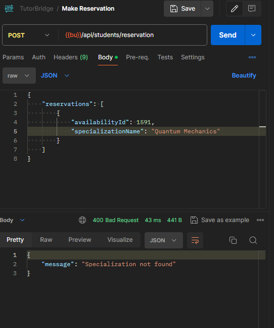
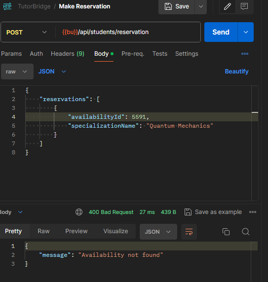

# Bazy danych 2 - projekt TutorBridge

# Skład grupy
- Piotr Karamon
- Tomasz Żmuda

#  Tytuł(temat) projektu

TutorBridge

Aplikacja bazodanowa zaprojektowana do wsparcia zarówno korepetytorów, jak i
uczniów poszukujących indywidualnych lekcji. Korepetytorzy będą mogli
wyspecyfikować swoje dostępne godziny, swoje specjalizacje(np. matematyka, angielski).
Uczniowie będą mogli rezerwować poszczególne lekcje.

# SZBD i technologie realizacji projektu

Oracle PL/SQL i Java Hibernate.

Backend jest napisany w języku Java z wykorzystaniem Spring Boot.
Backend to api, które na wejściu przyjmuje najczęściej 
dane w postaci json, komunikuje się z bazą danych wykonując
dane zadanie a następnie w postaci json zwraca wynik.
Frontend chociaż nie jest dostarczony, to zakładamy, że będzie to aplikacja webowa,
napisana w React.

Frontend powinien możliwić użytkownikom
zarejestrowanie się, zalogowanie, przeglądanie dostępnych korepetytorów
dla studentów, podejrzenie swoich danych, ich zmiana itp.

Co do ustawiania dostępnych godzin przez korepetytorów, to
zakładamy, że będzie to zrobione w formie kalendarza, gdzie korepetytor
będzie mógł zaznaczyć w których godzinach w tygodniu jest dostępny.

Podobny widok powinien być dostępny dla studentów, którzy 
są zainteresowani rezerwacją lekcji u danego korepetytora.

#  Link do repozytorium
https://github.com/pkaramon/bazy-danych-2-projekt-Piotr-Karamon-Tomasz-Zmuda

# Funkcje

1. Rejestracja(Tutor & Student)
    + wszyscy podają dane jak imię, nazwisko, email, hasło, numer telefonu
    + korepetytorzy podają swoje specjalizacje np. (angielski
      podstawowy,angielski C1, matematyka licealna etc)
    + uczniowie podają informacje o tym czy są w (podstawówce, liceum etc.)

2. Logowanie(Tutor & Student)

3. Wyznaczenie dostępnych godzin(Tutor)
   Korepetytorzy zaznaczają w których godzinach w tygodniu mają czas by prowadzić zajęcia.

   Usunięcie/modyfikacja dostępnych godzin nie ma wpływu na rezerwacje(nie są
   automatycznie anulowane etc).

4. Modyfikacja(dodanie, usunięcie) specjalizacji(Tutor)

5. Dodanie czasu nieobecności(np. urlop, choroba, etc) (Tutor)
   Korepetytorzy mogą wyznaczyć pewien przedział czasowy w którym to pomimo, że
   zazwyczaj mogą prowadzić zajęcia, to jednak z jakichś powodów nie będą wtedy
   dostępni.

   Jeżeli występują rezerwacje w podanym przedziale czasowym to są automatycznie
   anulowane.

6. Dodanie rezerwacji(Student)
   Student rezerwuje zajęcia u danego tutora.
   Konieczne jest tu sprawdzenie dostępności.

   Możliwa jest rezerwacja jednych zajęć,
   lub wielu jednocześnie.

7. Potwierdzenie rezerwacji(Tutor)

8. Anulowanie rezerwacji(Tutor & Student)

9. Wyświetlenie planu(Tutor & Student) (np. na tydzień/dwa/miesiąc)
    Korepetytorzy i uczniowie mogą zobaczyć plan zajęć na najbliższy tydzień/dwa/miesiąc.
    Plan zawiera informacje o zajęciach, uczniach, specjalizacjach, statusie rezerwacji.
    Podane są w wszczególności dane kontaktowe obu stron.

10. Wyszukiwanie odpowiedniego tutora(Student).
    Filtrowanie po dostępności i specjalizacjach. 

# Schemat 

Na początku stworzyliśmy schemat naszej bazy,
który potem odwzorowaliśmy w hibernate.


Tabela recenzji została zostawiona na schemacie,
lecz jest ona niewykorzystana w naszym projekcie.

Każdej tabeli odpowiada jeden plik w katalogu entities.
Poza zwykłym odwzorowaniem bazy, stworzyliśmy indeksy
na kolumnach, które są często używane w zapytaniach.

Korzystając z jakarta.validation, dodaliśmy walidację pól
w naszych encjach. Dzięki temu mamy pewność, że dane
przechowywane w bazie spełniają określone wymagania, co 
znacząco zwiększa integralność danych. Jest to jednak
walidacja trochę nad wyraz, ponieważ dane również
są walidowane w kontrolerach/serwisach. Umieszczenie
walidacji również w encjach powoduje, że nie zależnie 
od tego, skąd pochodzą dane, zawsze będą one walidowane.

Innym sposobem na dodanie walidacji jest wykorzystanie
warunków w bazie danych, jednak nie wybraliśmy tej opcji,
ponieważ nie jest ona tak elastyczna jak walidacja w javie.
Największą wadą jest to, że logika systemu jest rozproszona
poza kodem, co sprawia, że trudniej jest zrozumieć działanie
systemu, w szczególności dla osób które są w nowe w projekcie.

W naszym projekcie zdecydowaliśmy się na minimalizację użycia surowych zapytań SQL na rzecz implementacji logiki
biznesowej w Javie i Hibernate. Dzięki temu kod jest
skupiony w jednym miejscu, co ułatwia jego zrozumienie i utrzymanie.
Dużą zaletą takiego rozwiązania jest również to, że 
o wiele łatwiejsza jest
zmiana serwera bazy danych, ponieważ nie trzeba zmieniać
kodu, a jedynie konfigurację(oczywiście są pewne wyjątki).


## User

Abstrakcyjna klasa reprezentująca użytkownika w systemie.

### Pola
- **userId**: `Long` - Unikalny identyfikator użytkownika.
- **firstName**: `String` - Imię użytkownika.
- **lastName**: `String` - Nazwisko użytkownika.
- **phone**: `String` - Numer telefonu użytkownika.
- **email**: `String` - Adres e-mail użytkownika. Musi być unikalny.
- **password**: `String` - Hasło użytkownika w postaci zahaszowanej.
- **type**: `UserType` - Typ użytkownika (STUDENT lub TUTOR).
- **birthDate**: `LocalDate` - Data urodzenia użytkownika.

### Klasy dziedziczące
- **Student** - Reprezentuje studenta w systemie.
- **Tutor** - Reprezentuje tutora w systemie.

```java
@Entity
@Table(name = "\"User\"", uniqueConstraints = {
        @UniqueConstraint(columnNames = "EMAIL")
})
@Inheritance(strategy = InheritanceType.JOINED)
public abstract class User {

    @Id
    @GeneratedValue(strategy = GenerationType.IDENTITY)
    @Column(name = "USERID", nullable = false)
    private Long userId;

    @NotBlank(message = "First name is required")
    @Column(name = "FIRSTNAME", nullable = false, length = 100)
    private String firstName;

    @NotBlank(message = "Last name is required")
    @Column(name = "LASTNAME", nullable = false, length = 100)
    private String lastName;

    @NotBlank(message = "Phone number is required")
    @PhoneNumber
    @Column(name = "PHONE", nullable = false, length = 20)
    private String phone;

    @Email(message = "Email must be valid")
    @Column(name = "EMAIL", nullable = false, length = 100)
    private String email;


    @NotBlank(message = "Password is required")
    @Column(name = "PASSWORD", nullable = false, length = 1024)
    private String password;

    @Enumerated(EnumType.STRING)
    @Column(name = "TYPE", nullable = false, length = 100)
    private UserType type;

    @NotNull(message = "Birthdate is required")
    @Past(message = "Birthdate must be in the past")
    @Column(name = "BIRTHDATE", nullable = false)
    private LocalDate birthDate;


    public User(String firstName,
                String lastName,
                String phone,
                String email,
                String password,
                UserType type,
                LocalDate birthDate) {
        this.firstName = firstName;
        this.lastName = lastName;
        this.phone = phone;
        this.email = email;
        this.password = password;
        this.type = type;
        this.birthDate = birthDate;
    }

    public User() {
    }
    
    // getters and setters omitted
}
```

## Tutor


Reprezentuje tutora w systemie.

### Pola
- zawiera wszystkie pola z klasy `User`
- **bio**: `String` - Krótki opis (biografia) tutora. Maksymalna długość to 4000 znaków.
- **specializations**: `Set<Specialization>` - Zestaw specjalizacji przypisanych do tutora.
- **absences**: `Set<Absence>` - Zestaw nieobecności tutora.
- **availabilities**: `Set<Availability>` - Zestaw dostępności tutora.
- **reservations**: `Set<Reservation>` - Zestaw rezerwacji powiązanych z tutorem.

### Połączenia
- Tutor może mieć wiele specjalizacji (`@ManyToMany`).
- Tutor może mieć wiele nieobecności (`@OneToMany`).
- Tutor może mieć wiele dostępności (`@OneToMany`).
- Tutor może mieć wiele rezerwacji (`@OneToMany`).

```java
@Entity
@Table(name = "TUTOR")
@PrimaryKeyJoinColumn(name = "TUTORID")
public class Tutor extends User {

    @ManyToMany
    @JoinTable(
            name = "TUTORSPECIALIZATIONS",
            joinColumns = @JoinColumn(name = "TUTORID"),
            inverseJoinColumns = @JoinColumn(name = "SPECIALIZATIONID")
    )
    private final Set<Specialization> specializations = new HashSet<>();
    @Column(name = "BIO", length = 4000, nullable = false)
    @Nationalized
    private String bio;
    @OneToMany(mappedBy = "tutor", cascade = CascadeType.ALL, orphanRemoval = true)
    private Set<Absence> absences = new HashSet<>();

    @OneToMany(mappedBy = "tutor", cascade = CascadeType.ALL, orphanRemoval = true)
    private Set<Availability> availabilities = new HashSet<>();

    @OneToMany(mappedBy = "tutor", cascade = CascadeType.ALL, orphanRemoval = true)
    private Set<Reservation> reservations = new HashSet<>();

    public Tutor() {
    }

    public Tutor(String firstName,
                 String lastName,
                 String phone,
                 String email,
                 String password,
                 String bio,
                 LocalDate birthDate) {
        super(firstName, lastName, phone, email, password, UserType.TUTOR, birthDate);
        this.bio = bio;
    }
    // getters and setters omitted
}
```

## Specialization


Reprezentuje specjalizację tutora.

### Pola
- **specializationId**: `Long` - Unikalny identyfikator specjalizacji. Generowany automatycznie.
- **name**: `String` - Nazwa specjalizacji. Musi być unikalna i nie może być pusta.
- **tutors**: `Set<Tutor>` - Zestaw tutorów powiązanych z tą specjalizacją.

### Połączenia
- Wiele specjalizacji może być powiązanych z wieloma tutorami (`@ManyToMany`).

### Konstruktor
- Domyślny konstruktor.
- Konstruktor z parametrem `name`.

```java
@Entity
@Table(name = "SPECIALIZATION",
        uniqueConstraints = @UniqueConstraint(columnNames = "NAME")
)
public class Specialization {

    @ManyToMany(mappedBy = "specializations")
    private final Set<Tutor> tutors = new HashSet<>();
    @Id
    @GeneratedValue(strategy = GenerationType.IDENTITY)
    @Column(name = "SPECIALIZATIONID", nullable = false)
    private Long specializationId;
    @NotBlank(message = "Specialization name is required")
    @Column(name = "NAME", nullable = false, length = 200)
    private String name;

    public Specialization() {
    }

    public Specialization(String name) {
        this.name = name;
    }
    
    // getters and setters omitted
}
```

## Student

Reprezentuje studenta w systemie.

### Pola
- zawiera wszystkie pola z klasy `User`
- **level**: `StudentLevel` - Poziom nauki studenta (PRIMARY_SCHOOL, MIDDLE_SCHOOL, HIGH_SCHOOL, COLLEGE, UNIVERSITY).
- **reservations**: `Set<Reservation>` - Zestaw rezerwacji powiązanych ze studentem.

### Połączenia
- Student może mieć wiele rezerwacji (`@OneToMany`).


```java
@Entity
@Table(name = "STUDENT")
@PrimaryKeyJoinColumn(name = "STUDENTID", referencedColumnName = "USERID")
public class Student extends User {
    @Enumerated(EnumType.STRING)
    @Column(name = "\"level\"", nullable = false, length = 100)
    private StudentLevel level;

    @OneToMany(mappedBy = "student", cascade = CascadeType.ALL, orphanRemoval = true)
    private Set<Reservation> reservations = new HashSet<>();

    public Student() {
    }

    public Student(String firstName,
                   String lastName,
                   String phone,
                   String email,
                   String password,
                   StudentLevel level,
                   LocalDate birthDate) {
        super(firstName, lastName, phone, email, password, UserType.STUDENT, birthDate);
        this.level = level;
    }

    // getters and setters omitted
}
```

### StudentLevel.java
```java
package org.tutorBridge.entities.enums;

public enum StudentLevel {
    PRIMARY_SCHOOL,
    MIDDLE_SCHOOL,
    HIGH_SCHOOL,
    COLLEGE,
    UNIVERSITY
}
```

## Availability

Reprezentuje dostępność tutora.

### Pola
- **availabilityId**: `Long` - Unikalny identyfikator dostępności. Generowany automatycznie.
- **tutor**: `Tutor` - Tutor powiązany z dostępnością.
- **startDateTime**: `LocalDateTime` - Data i czas rozpoczęcia dostępności.
- **endDateTime**: `LocalDateTime` - Data i czas zakończenia dostępności.

### Indeksy
- `Availability_idx_tutorID`: Indeks na kolumnie `TUTORID`.
- `Availability_idx_startDate`: Indeks na kolumnie `STARTDATE`.
- `Availability_idx_endDate`: Indeks na kolumnie `ENDDATE`.

### Połączenia
- Wiele dostępności może być powiązanych z jednym tutorem (`@ManyToOne`).


```java
@Entity
@ValidAvailabilityRange
@Table(name = "AVAILABILITY",
        indexes = {
                @Index(name = "Availability_idx_tutorID", columnList = "TUTORID"),
                @Index(name = "Availability_idx_startDate", columnList = "STARTDATE"),
                @Index(name = "Availability_idx_endDate", columnList = "ENDDATE")
        }
)
public class Availability {
    @Id
    @GeneratedValue(strategy = GenerationType.IDENTITY)
    @Column(name = "AVAILABILITYID", nullable = false)
    private Long availabilityId;

    @ManyToOne
    @JoinColumn(name = "TUTORID", nullable = false)
    private Tutor tutor;

    @NotNull(message = "Start date is required")
    @Column(name = "STARTDATE", nullable = false)
    private LocalDateTime startDateTime;


    @NotNull(message = "End date is required")
    @Column(name = "ENDDATE", nullable = false)
    private LocalDateTime endDateTime;


    public Availability() {
    }

    public Availability(Tutor tutor, LocalDateTime start, LocalDateTime end) {
        this.tutor = tutor;
        this.startDateTime = start;
        this.endDateTime = end;
    }
    
    // getters and setters omitted
}
```

## Absence

Reprezentuje nieobecność tutora.

### Pola
- **absenceId**: `Long` - Unikalny identyfikator nieobecności. Generowany automatycznie.
- **tutor**: `Tutor` - Tutor powiązany z nieobecnością.
- **startDate**: `LocalDateTime` - Data i czas rozpoczęcia nieobecności.
- **endDate**: `LocalDateTime` - Data i czas zakończenia nieobecności.

### Indeksy
- `Absence_idx_tutorID`: Indeks na kolumnie `TUTORID`.
- `Absence_idx_startDate`: Indeks na kolumnie `STARTDATE`.
- `Absence_idx_endDate`: Indeks na kolumnie `ENDDATE`.

### Połączenia
- Wiele nieobecności może być powiązanych z jednym tutorem (`@ManyToOne`).


```java
@Entity
@ValidAbsenceRange
@Table(name = "Absence",
        indexes = {
                @Index(name = "Absence_idx_tutorID", columnList = "TUTORID"),
                @Index(name = "Absence_idx_startDate", columnList = "STARTDATE"),
                @Index(name = "Absence_idx_endDate", columnList = "ENDDATE")
        }
)
public class Absence {
    @Id
    @GeneratedValue(strategy = GenerationType.IDENTITY)
    @Column(name = "ABSENCEID", nullable = false)
    private Long absenceId;

    @ManyToOne
    @JoinColumn(name = "TUTORID", nullable = false)
    private Tutor tutor;

    @NotNull(message = "Start date is required")
    @Column(name = "STARTDATE", nullable = false)
    private LocalDateTime startDate;

    @NotNull(message = "End date is required")
    @Column(name = "ENDDATE", nullable = false)
    private LocalDateTime endDate;

    public Absence() {
    }

    public Absence(Tutor tutor, LocalDateTime startDate, LocalDateTime endDate) {
        this.tutor = tutor;
        this.startDate = startDate;
        this.endDate = endDate;
    }

    // getters and setters omitted
}
```

### UserType.java
```java
package org.tutorBridge.entities.enums;

public enum UserType {
    STUDENT,
    TUTOR
}

```

## Reservation

Reprezentuje rezerwację sesji z tutorem.

### Pola
- **reservationId**: `Long` - Unikalny identyfikator rezerwacji. Generowany automatycznie.
- **student**: `Student` - Student dokonujący rezerwacji.
- **tutor**: `Tutor` - Tutor powiązany z rezerwacją.
- **specialization**: `Specialization` - Specjalizacja powiązana z rezerwacją.
- **startDateTime**: `LocalDateTime` - Data i czas rozpoczęcia rezerwacji.
- **endDateTime**: `LocalDateTime` - Data i czas zakończenia rezerwacji.
- **status**: `ReservationStatus` - Status rezerwacji (ACCEPTED, CANCELLED, NEW).

### Indeksy
- `Reservation_idx_studentID`: Indeks na kolumnie `STUDENTID`.
- `Reservation_idx_tutorID`: Indeks na kolumnie `TUTORID`.
- `Reservation_idx_specializationID`: Indeks na kolumnie `SPECIALIZATIONID`.
- `Reservation_idx_startDate`: Indeks na kolumnie `STARTDATE`.
- `Reservation_idx_endDate`: Indeks na kolumnie `ENDDATE`.
- `Reservation_idx_status`: Indeks na kolumnie `STATUS`.

### Połączenia
- Wiele rezerwacji może być powiązanych z jednym studentem (`@ManyToOne`).
- Wiele rezerwacji może być powiązanych z jednym tutorem (`@ManyToOne`).
- Wiele rezerwacji może być powiązanych z jedną specjalizacją (`@ManyToOne`).

```java
@Entity
@Table(name = "RESERVATION",
indexes = {
    @Index(name = "Reservation_idx_studentID", columnList = "STUDENTID"),
    @Index(name = "Reservation_idx_tutorID", columnList = "TUTORID"),
    @Index(name = "Reservation_idx_specializationID", columnList = "SPECIALIZATIONID"),
    @Index(name = "Reservation_idx_startDate", columnList = "STARTDATE"),
    @Index(name = "Reservation_idx_endDate", columnList = "ENDDATE"),
    @Index(name = "Reservation_idx_status", columnList = "STATUS")
}
)
public class Reservation {

    @Id
    @GeneratedValue(strategy = GenerationType.IDENTITY)
    @Column(name = "RESERVATIONID", nullable = false)
    private Long reservationId;

    @ManyToOne
    @JoinColumn(name = "STUDENTID", nullable = false)
    private Student student;

    @ManyToOne
    @JoinColumn(name = "TUTORID", nullable = false)
    private Tutor tutor;

    @ManyToOne
    @JoinColumn(name = "SPECIALIZATIONID", nullable = false)
    private Specialization specialization;

    @NotNull(message = "Start time is required")
    @Column(name = "STARTDATE", nullable = false)
    private LocalDateTime startDateTime;

    @NotNull(message = "End time is required")
    @Column(name = "ENDDATE", nullable = false)
    private LocalDateTime endDateTime;

    @Enumerated(EnumType.STRING)
    @Column(name = "STATUS", length = 10, nullable = false)
    private ReservationStatus status;
    public Reservation() {}

    public Reservation(Student student, Tutor tutor, Specialization specialization, LocalDateTime start, LocalDateTime end) {
        this.student = student;
        this.tutor = tutor;
        this.specialization = specialization;
        this.startDateTime = start;
        this.endDateTime = end;
        this.status = ReservationStatus.NEW;
    }
    // getters and setters omitted
}
```

### ReservationStatus.java
```java
package org.tutorBridge.entities.enums;

public enum ReservationStatus {
    ACCEPTED,
    CANCELLED,
    NEW
}
```

# W zastosowaniu

## Rejestracja tutora

### W przypadku złych danych:


### W przypadku użycia tego samego emaila:


### W przypadku poprawnych danych:


## Rejestracja studenta

### W przypadku złych danych
Praktycznie to samo co w rejestracji tutora

### W przypadku dobrych danych


## Logowanie

### Brak podania emaila albo hasła


### W przypadku złych danych


### W przypadku poprawnych danych


Wszystkie kolejne requesty
zawierają w sobie token JWT.

## Zmiana danych tutora w tym wybór specjalizacji

Podane specjalizacje nadpisują obecne.

### W przypadku złych danych


### W przyadku poprawnych danych


## Zmiana danych studenta

### W przypadku złych danych


### W przypadku poprawnych danych


## Wybranie godzin dostępności przez tutora

Podane zakresy są slotami.
Wypełnianie ich manualnie jest dosyć żmudne.
Przewidujemy, że request będzie tworzył
kod na frontendcie który w zależności od
wyboru tutora ustawi sloty co odpowiednią ilość czasu.

Sytem w przedziale czasowym danym przez <startDate, endDate>
stworzy odpowiednie wpisy do tabeli Availability.

Obecności ustawione w tym okresie są usuwane i
zastępowane nowymi. Również jeżeli była
wpisana nieobecność w tym okresie to ja usuwamy.

### W przypadku złych danych


### W przypadku poprawnych danych


## Pobranie godzin dostępności


Opcjonalnie można podać przedział czasowy,
w postaci `{"start": ..., "end": ...}`.


## Wyszukanie tutorów przez studenta

Student wysyła w jakim przedziale
szuka zajęć oraz specjalizację która go
interesuję.

### W przypadku złych danych


### W przypadku poprawnych danych


## Rezerwacja zajęć

Sprawdzamy czy slot rzeczywiście jest w bazie.
Inne sloty które się z nim nakładają są usuwane.
Dodawana jest rezerwacja.

Możliwa jest rezerwacja wielu slotów na raz,
wszystko wykonywane jest w jednej transakcji.

### W przypadku złych danych




Próba zarezerowania dwóch
slotów które nachodzą na siebie.


## W przypadku poprawnych danych


## Pobranie planu zajęć

Zarówno studenci jak i tutorzy mogą pobrać plan zajęć,
w którym znajdują się wszystkie potrzebne informacje
o rezerwacjach, uczniu i tutorze.

### W przypadku studenta


Jest opcja podania
przedziału czasowego dla którego
chcemy plan.


### Dla tutora


Tak samo można podać przedział czasowy.

## Anulowanie rezerwacji przez studenta

Złe dane:


Poprawne dane:


## Tutor może zmieniać status rezerwacji

Może albo je zaakceptować albo anulować.


## Dodanie czasu nieobecności tutora

Tutor może wpisać nieobecność w danym przedziale czasowym.
Dostępne sloty są usuwane.
Rezerwacje w tym przedziale czasowym są anulowane.


Przykład przy błędnych danych.


## Listę nieobecności tutor może pobrać

Podobnie jak przy pobieraniu
planu można podać `{"start": ..., "end": ...}`
w celu wyboru przedziału.


## Tutor może usunąć nieobecność


Jeżeli chcę w tym okresie
dalej prowadzić zajęcia to
musi na nowo ustawić sobie plan.
Zwracana jest nowa lista nieobecności
dlatego wynik jest pustą
tablicą.


# Architektura aplikacji

Aplikacja składa się z kilku warstw:

- **Encje** - reprezentują obiekty w bazie danych.
- **Repozytoria** - warstwa dostępu do bazy danych.
- **Serwisy** - warstwa logiki biznesowej.
- **Kontrolery** - warstwa obsługi zapytań HTTP.

Encje zostały już omówione.

Poprzez repozytoria odbywa się komunikacja z bazą danych.
Jeżeli potrzebujemy np. 
pobrać wszystkie rezerwacje dla danego studenta,
znależć użytkownika po adresie email,
to właśnie te zadania wykonują repozytoria.

Serwisy to warstwa logiki biznesowej.
To tutaj znajduje się logika aplikacji.
Serwisy korzystają z repozytoriów, aby
pobrać dane z bazy, a następnie przetworzyć
je w odpowiedni sposób.

Kontrolery to warstwa obsługi zapytań HTTP.
To tutaj znajduje się logika obsługi zapytań.
Kontrolery z racji tego, jak dużo 
pracy zautomatyzwane jest przez Spring Boot,
zawierają bardzo mało kodu.
Jest to praktycznie wylistowanie pod jakim 
adresem użytkownik może przesłać co, 
następnie wykonanie funkcji z serwisu i zwrócenie
wyniku.

Dlaczego seriwsy są odzielne od kontrolerów?

- Logika biznesowa w serwisach może być wykorzystywana przez różne kontrolery i komponenty aplikacji.
   Umożliwia to np. dodanie obsługi protokołu GraphQL, Protobuf,  itp.
   bez konieczności zmiany logiki biznesowej.
- Serwisy mogą być testowane niezależnie od warstwy webowej, co ułatwia tworzenie testów jednostkowych i integracyjnych.
- Wyraźne oddzielenie logiki biznesowej od logiki obsługi żądań HTTP sprawia, że kod jest bardziej czytelny i łatwiejszy do utrzymania.
- Oddzielenie logiki pozwala na łatwiejszą modyfikację i rozszerzanie aplikacji bez ryzyka wprowadzenia błędów w innych częściach kodu.

Dlaczego repozytoria są odzielne od serwisów?

- Repozytoria mogą być używane przez różne serwisy, umożliwiając wielokrotne wykorzystanie kodu dostępu do danych.
- Oddzielenie warstw pozwala na łatwiejsze modyfikacje i optymalizacje w jednym miejscu bez wpływu na inne części aplikacji. Na przykład, można zmienić implementację repozytorium bez konieczności modyfikacji logiki biznesowej w serwisach.
- Repozytoria i serwisy mogą być testowane niezależnie, co ułatwia tworzenie testów jednostkowych i integracyjnych.

# Walidacja

Znaczna większość walidacji jest
wykonywana w sposób automatyczny.
Podstawową walidację, czyli sprawdzenie
czy użytkownik przesłał poprawnie
sformatowany json, wykonuje Spring Boot.
Spring zamienia json na obiekt
który podaliśmy. W efekcie nie musimy
zajmować się bardzo niskopoziomową walidacją,
taką jak: "Czy użytkownik przesłał poprawną liczbę/datę".
Ponad to takie obiekty są bardzo łatwe w użyciu.


Aby sprawdzić czy podane wartości przez użytkownika
spełniają inne warunki niż zgodność typów, użyliśmy
jakarta.validation.
Jest to bardzo wygodna biblioteka, która pozwala
na dodanie walidacji adnotacjami, w których to
możemy również podać komunikat, który zostanie
zwrócony w przypadku niepoprawnych danych.
Jest to szczególnie wygodne w przypadku serwera
backend, bo możemy w łątwy sposób zwrócić
użytkownikowi informację o tym jakie dane
nie spełniają warunków(np. w celu wyświetlenia
komunikatu w formularzu na frontendzie).

Dosyć łatwo również jest roszerzać walidację o własne
warunki. Wystarczy stworzyć nową adnotację i klasę
która będzie ją obsługiwać.

Taka walidacja danych, połączona z
automatycznym mapowaniem json na obiekt
sprawia, że nie musimy sami zajmować
się niskopoziomową ekstrakcją danych
oraz żmudnym pisaniem warunków, lub
tworzeniem własnych klas/bibliotek do walidacji.

Poniżej zamieszczamy 
customwe walidatory, które
dodaliśmy do naszego projektu.

## PhoneNumber

Sprawdza czy numer telefonu jest poprawny.

```java
package org.tutorBridge.validation;

@Documented
@Constraint(validatedBy = PhoneNumberValidator.class)
@Target({ElementType.METHOD, ElementType.FIELD})
@Retention(RetentionPolicy.RUNTIME)
public @interface PhoneNumber {
    String message() default "Invalid phone number";

    Class<?>[] groups() default {};

    Class<?>[] payload() default {};
}

```

```java
package org.tutorBridge.validation;

public class PhoneNumberValidator implements ConstraintValidator<PhoneNumber, String> {
    private static final Pattern PHONE_PATTERN = Pattern.compile("^\\+?[0-9. ()-]{7,25}$");

    @Override
    public boolean isValid(String phone, ConstraintValidatorContext context) {
        if (phone == null) {
            return true;
        }

        return PHONE_PATTERN.matcher(phone).matches();

    }
}
```
## NullOrNotEmpty

Sprawdza czy podany String jest albo nullem albo nie jest pusty.

```java
@Constraint(validatedBy = NullOrNotEmptyValidator.class)
@Target({ ElementType.FIELD, ElementType.METHOD, ElementType.PARAMETER, ElementType.ANNOTATION_TYPE })
@Retention(RetentionPolicy.RUNTIME)
public @interface NullOrNotEmpty {
    String message() default "Field must be null or not empty";
    Class<?>[] groups() default {};
    Class<? extends Payload>[] payload() default {};
}
```

```java
public class NullOrNotEmptyValidator implements ConstraintValidator<NullOrNotEmpty, String> {

    @Override
    public void initialize(NullOrNotEmpty constraintAnnotation) {
    }

    @Override
    public boolean isValid(String value, ConstraintValidatorContext context) {
        return value == null || !value.trim().isEmpty();
    }
}

```


## ValidAbsenceRange

Sprawdza czy data początkowa jest przed datą końcową.

```java
package org.tutorBridge.validation;


@Documented
@Constraint(validatedBy = AbsenceRangeValidator.class)
@Target({ElementType.TYPE})
@Retention(RetentionPolicy.RUNTIME)
public @interface ValidAbsenceRange {
    String message() default "Invalid date range: getStart date must be before getEnd date";

    Class<?>[] groups() default {};

    Class<? extends Payload>[] payload() default {};
}

```


```java
package org.tutorBridge.validation;


public class AbsenceRangeValidator implements ConstraintValidator<ValidAbsenceRange, Absence> {

    @Override
    public void initialize(ValidAbsenceRange constraintAnnotation) {
    }

    @Override
    public boolean isValid(Absence absence, ConstraintValidatorContext context) {
        if (absence == null) {
            return false;
        }
        if (absence.getStartDate() == null || absence.getEndDate() == null) {
            return false;
        }
        return absence.getStartDate().isBefore(absence.getEndDate());
    }
}
```

## AvailabilityRangeValidator

Sprawdza czy data początkowa jest przed datą końcową.
Jest to bardzo podobny walidator do ValidAbsenceRange.
Wadą jakarta.validation jest to, że 
ciężko jest pisać uniwersalne walidatory,
które sprawdzają zależności pomiędzy dwoma 
lub więcej polami. 


```java
package org.tutorBridge.validation;


@Documented
@Constraint(validatedBy = AvailabilityRangeValidator.class)
@Target({ElementType.TYPE})
@Retention(RetentionPolicy.RUNTIME)
public @interface ValidAvailabilityRange {
    String message() default "Invalid time range";

    Class<?>[] groups() default {};

    Class<?>[] payload() default {};
}

```

```java
package org.tutorBridge.validation;


public class AvailabilityRangeValidator implements ConstraintValidator<ValidAvailabilityRange,
        Availability> {
    @Override
    public boolean isValid(Availability availability,
                           ConstraintValidatorContext constraintValidatorContext) {
        if (availability == null) {
            return false;
        }
        return availability.getStartDateTime().isBefore(availability.getEndDateTime());
    }
}

```


## TimeRangeDTOValidator
Sprawdza czy przedział czasowy 
godzina:minuta - godzina:minuta jest poprawny.
```java
package org.tutorBridge.validation;

public class TimeRangeDTOValidator implements ConstraintValidator<ValidTimeRangeDTO,
        TimeRangeDTO> {
    @Override
    public boolean isValid(TimeRangeDTO timeRangeDTO,
                           ConstraintValidatorContext constraintValidatorContext) {
        if (timeRangeDTO == null) {
            return true;
        }

        return timeRangeDTO.getStart().isBefore(timeRangeDTO.getEnd());
    }
}

```

```java
package org.tutorBridge.validation;


@Documented
@Constraint(validatedBy = TimeRangeDTOValidator.class)
@Target({ElementType.TYPE})
@Retention(RetentionPolicy.RUNTIME)
public @interface ValidTimeRangeDTO {
    String message() default "Invalid time range";

    Class<?>[] groups
            () default {};

    Class<? extends Payload>[] payload() default {};
}

```

## ValidationException

Klasa wyjątku, który jest rzucony w przypadku
niepoprawnych danych.

```java
package org.tutorBridge.validation;


public class ValidationException extends RuntimeException {
    private final Collection<String> messages;

    public ValidationException(String message) {
        super(message);
        this.messages = List.of(message);
    }

    public ValidationException(Collection<String> messages) {
        super(String.join("\n", messages));
        this.messages = messages;
    }
}

```

# Bezpieczeństwo

Aby zapewnić bezpieczeństwo aplikacji, wykorzystujemy kilka kluczowych komponentów do uwierzytelniania i autoryzacji użytkowników.
Poniżej przedstawiono omówienie poszczególnych klas i ich roli w procesie zabezpieczania aplikacji.

Autorzyzacja w naszej aplikacji opiera się na tokenach JWT (JSON Web Token).
W tokenie JWT przechowywane są informacje o użytkowniku: adres e-mail, rola i czas ważności.

Na podstawie roli użytkownika, aplikacja decyduje, czy użytkownik ma dostęp do określonych zasobów.

## CustomUserDetailsService
- Ta klasa implementuje `UserDetailsService` i jest odpowiedzialna za ładowanie szczegółów użytkownika na podstawie jego adresu e-mail.
- Używa `UserRepo` do wyszukiwania użytkownika w bazie danych.
- `loadUserByUsername(String email)`: Zwraca obiekt `UserDetails` zawierający informacje o użytkowniku, takie jak nazwa użytkownika, hasło i role.

```java
package org.tutorBridge.security;


@Service
public class CustomUserDetailsService implements UserDetailsService {

    private final UserRepo userRepo;

    public CustomUserDetailsService(UserRepo userRepo) {
        this.userRepo = userRepo;
    }

    @Override
    public UserDetails loadUserByUsername(String email) throws UsernameNotFoundException {
        User user = userRepo.findByEmail(email).orElseThrow(() ->
                new UsernameNotFoundException("User not found with email: " + email));

        return org.springframework.security.core.userdetails.User
                .withUsername(user.getEmail())
                .password(user.getPassword())
                .authorities(user.getType().toString())
                .accountExpired(false)
                .accountLocked(false)
                .credentialsExpired(false)
                .disabled(false)
                .build();
    }
}
```


## JwtAuthenticationEntryPoint
- Implementuje `AuthenticationEntryPoint` i jest używana do obsługi nieautoryzowanych żądań.
- Gdy użytkownik nie jest uwierzytelniony, wysyła odpowiedź HTTP 401 (Unauthorized).

```java
package org.tutorBridge.security;

@Component
public class JwtAuthenticationEntryPoint implements AuthenticationEntryPoint {

    @Override
    public void commence(HttpServletRequest request, HttpServletResponse response,
                         AuthenticationException authException) throws IOException {
        response.sendError(HttpServletResponse.SC_UNAUTHORIZED, "Unauthorized");
    }
}

```

## JwtAuthenticationFilter
- Rozszerza `OncePerRequestFilter` i jest odpowiedzialny za filtrowanie każdego żądania HTTP w celu sprawdzenia, czy zawiera ono ważny token JWT.
- Używa `JwtTokenUtil` do ekstrakcji informacji z tokena i `UserDetailsService` do ładowania szczegółów użytkownika.
- `doFilterInternal(HttpServletRequest request, HttpServletResponse response, FilterChain chain)`: Sprawdza nagłówek `Authorization` w celu ekstrakcji tokena JWT, waliduje go i ustawia kontekst bezpieczeństwa.


```java
package org.tutorBridge.security;

@Component
public class JwtAuthenticationFilter extends OncePerRequestFilter {

    private final JwtTokenUtil jwtTokenUtil;

    private final UserDetailsService userDetailsService;

    public JwtAuthenticationFilter(JwtTokenUtil jwtTokenUtil, UserDetailsService userDetailsService) {
        this.jwtTokenUtil = jwtTokenUtil;
        this.userDetailsService = userDetailsService;
    }

    @Override
    protected void doFilterInternal(HttpServletRequest request,
                                    HttpServletResponse response,
                                    FilterChain chain)
            throws ServletException, IOException {
        final String authorizationHeader = request.getHeader("Authorization");

        String email = null;
        String jwt = null;

        if (authorizationHeader != null && authorizationHeader.startsWith("Bearer ")) {
            jwt = authorizationHeader.substring(7);
            email = jwtTokenUtil.extractUserEmail(jwt);
        }

        if (email != null && SecurityContextHolder.getContext().getAuthentication() == null) {
            UserDetails userDetails = this.userDetailsService.loadUserByUsername(email);
            if (jwtTokenUtil.validateToken(jwt, userDetails.getUsername())) {
                UsernamePasswordAuthenticationToken authentication = new UsernamePasswordAuthenticationToken(
                        userDetails, null, userDetails.getAuthorities());
                authentication.setDetails(new WebAuthenticationDetailsSource().buildDetails(request));
                SecurityContextHolder.getContext().setAuthentication(authentication);
            }
        }

        chain.doFilter(request, response);
    }
}

```


## JwtTokenUtil
- Ta klasa jest odpowiedzialna za zarządzanie tokenami JWT: generowanie, walidowanie i ekstrakcję informacji.
- `extractUserEmail(String token)`: Ekstrakcja adresu e-mail użytkownika z tokena.
- `generateToken(String email)`: Generuje token JWT na podstawie adresu e-mail.
- `validateToken(String token, String email)`: Waliduje token JWT, sprawdzając jego ważność i porównując adres e-mail.


```java
package org.tutorBridge.security;


@Component
public class JwtTokenUtil {

    @Value("${jwt.secret}")
    private String secretKey;

    public String extractUserEmail(String token) {
        return extractClaim(token, Claims::getSubject);
    }

    public Date extractExpiration(String token) {
        return extractClaim(token, Claims::getExpiration);
    }

    public <T> T extractClaim(String token, Function<Claims, T> claimsResolver) {
        final Claims claims = extractAllClaims(token);
        return claimsResolver.apply(claims);
    }

    private Claims extractAllClaims(String token) {
        return Jwts.parser()
                .setSigningKey(secretKey)
                .parseClaimsJws(token)
                .getBody();
    }

    private Boolean isTokenExpired(String token) {
        return extractExpiration(token).before(new Date());
    }

    public String generateToken(String email) {
        return createToken(email);
    }

    private String createToken(String email) {
        return Jwts.builder()
                .setSubject(email)
                .setIssuedAt(new Date(System.currentTimeMillis()))
                .setExpiration(new Date(System.currentTimeMillis() + 1000 * 60 * 60 * 10))
                .signWith(SignatureAlgorithm.HS256, secretKey)
                .compact();
    }

    public Boolean validateToken(String token, String email) {
        final String tokenEmail = extractUserEmail(token);
        return (tokenEmail.equals(email) && !isTokenExpired(token));
    }
}

```

## SecurityConfig
- Główna klasa konfiguracji bezpieczeństwa aplikacji, która definiuje reguły zabezpieczeń.
- `securityFilterChain(HttpSecurity http)`: Konfiguruje HTTP Security, definiuje które endpointy są publiczne, a które wymagają uwierzytelnienia. Ustawia także `JwtAuthenticationFilter` jako filtr przetwarzający żądania.
- `passwordEncoder()`: Definiuje użycie `BCryptPasswordEncoder` do kodowania haseł.


```java
package org.tutorBridge.security;


@Configuration
@EnableWebSecurity
public class SecurityConfig {

    private final JwtAuthenticationEntryPoint jwtAuthenticationEntryPoint;
    private final JwtAuthenticationFilter jwtAuthenticationFilter;

    public SecurityConfig(JwtAuthenticationEntryPoint jwtAuthenticationEntryPoint,
                          JwtAuthenticationFilter jwtAuthenticationFilter) {
        this.jwtAuthenticationEntryPoint = jwtAuthenticationEntryPoint;
        this.jwtAuthenticationFilter = jwtAuthenticationFilter;
    }

    @Bean
    public SecurityFilterChain securityFilterChain(HttpSecurity http) throws Exception {
        http
                .csrf(AbstractHttpConfigurer::disable)
                .authorizeHttpRequests(authorize -> authorize
                        .requestMatchers("/api/auth/login",
                                "/api/tutors/register",
                                "/api/students/register").permitAll()
                        .requestMatchers("/api/students/**").hasAuthority("STUDENT")
                        .requestMatchers("/api/tutors/**").hasAuthority("TUTOR")
                        .anyRequest().authenticated()
                )
                .exceptionHandling(exception -> exception
                        .authenticationEntryPoint(jwtAuthenticationEntryPoint)
                )
                .sessionManagement(session -> session
                        .sessionCreationPolicy(SessionCreationPolicy.STATELESS)
                )
                .formLogin(AbstractHttpConfigurer::disable)
                .httpBasic(AbstractHttpConfigurer::disable);

        http.addFilterBefore(jwtAuthenticationFilter, UsernamePasswordAuthenticationFilter.class);

        return http.build();
    }

    @Bean
    public AuthenticationManager authenticationManager (AuthenticationConfiguration authenticationConfiguration)
            throws Exception {
        return authenticationConfiguration.getAuthenticationManager();
    }

    @Bean
    public PasswordEncoder passwordEncoder() {
        return new BCryptPasswordEncoder();
    }
}

```

# Serwisy

Zawierają logikę biznesową aplikacji.
Wiele metod serwisów 
posiada adnotację `@Transactional`.
Co sprawia, że metoda jest wykonywana
w ramach jednej transakcji.
W przypadku samych odczytów
stosujemy `@Transactional(readOnly = true)`.

## UserService

`UserService` to abstrakcyjna klasa serwisowa obsługująca podstawowe operacje związane z użytkownikami.

- `registerUser(T user)`:
    - Sprawdza, czy użytkownik o podanym adresie e-mail już istnieje.
    - Haszuje hasło użytkownika.
    - Zapisuje użytkownika w bazie danych.
    - Wywołuje abstrakcyjną metodę `saveUser(T user)`, którą implementują klasy dziedziczące, aby zapisać specyficzne dane użytkownika.

```java
package org.tutorBridge.services;


@Service
public abstract class UserService<T extends User> {
    protected final UserRepo userRepo;
    private final PasswordEncoder passwordEncoder;

    @Autowired
    protected UserService(UserRepo userRepo, PasswordEncoder passwordEncoder) {
        this.userRepo = userRepo;
        this.passwordEncoder = passwordEncoder;
    }

    protected void registerUser(T user) {
        boolean userWithSameEmailExists = userRepo.findByEmail(user.getEmail()).isPresent();
        if (userWithSameEmailExists) {
            throw new ValidationException(List.of("User with the same email already exists"));
        }
        user.setPassword(passwordEncoder.encode(user.getPassword()));
        userRepo.save(user);
        saveUser(user);
    }

    protected abstract void saveUser(T user);
}
```


## TutorService

`TutorService` to klasa serwisowa obsługująca operacje związane z tutorami.

- `registerTutor(TutorRegisterDTO tutorData)`:
    - Tworzy nowy obiekt `Tutor` na podstawie danych z `TutorRegisterDTO`.
    - Ustawia specjalizacje tutora.
    - Sprawdza, czy specjalizacje już istnieją w bazie danych, jeśli nie, dodaje nowe.
    - Rejestruje użytkownika przy użyciu metody `registerUser` z klasy `UserService`.

- `updateTutorInfo(Tutor tutor, TutorUpdateDTO tutorData)`:
    - Aktualizuje informacje o tutorze na podstawie danych z `TutorUpdateDTO`.
    - Aktualizuje specjalizacje tutora.
    - Zapisuje zaktualizowane dane w bazie danych.

- `getTutorInfo(Tutor tutor)`:
    - Zwraca obiekt `TutorUpdateDTO` zawierający informacje o tutorze.

- `getSpecializations(Tutor tutor)`:
    - Zwraca specjalizacje przypisane do danego tutora.

- `saveUser(Tutor user)`:
    - Zapisuje tutora w bazie danych.
    - Metoda ta jest wywoływana przez metodę `registerUser` z klasy `UserService`.


```java
package org.tutorBridge.services;


@Service
public class TutorService extends UserService<Tutor> {
    private final TutorRepo tutorRepo;
    private final AvailabilityRepo availabilityRepo;
    private final SpecializationRepo specializationRepo;

    public TutorService(TutorRepo tutorRepo,
                        AvailabilityRepo availabilityRepo,
                        UserRepo userDao,
                        PasswordEncoder pe,
                        SpecializationRepo specializationRepo) {
        super(userDao, pe);
        this.tutorRepo = tutorRepo;
        this.availabilityRepo = availabilityRepo;
        this.specializationRepo = specializationRepo;
    }

    private static TutorUpdateDTO fromTutorToDTO(Tutor tutor) {
        return new TutorUpdateDTO(
                tutor.getFirstName(),
                tutor.getLastName(),
                tutor.getPhone(),
                tutor.getBirthDate(),
                tutor.getSpecializations()
                        .stream()
                        .map(Specialization::getName)
                        .collect(Collectors.toSet()),
                tutor.getBio());
    }

    @Transactional
    public void registerTutor(TutorRegisterDTO tutorData) {
        Tutor tutor = new Tutor(
                tutorData.getFirstName(),
                tutorData.getLastName(),
                tutorData.getPhone(),
                tutorData.getEmail(),
                tutorData.getPassword(),
                tutorData.getBio(),
                tutorData.getBirthDate()
        );
        tutor.setSpecializations(
                tutorData.getSpecializations().stream()
                        .map(Specialization::new)
                        .collect(Collectors.toSet())
        );

        for (Specialization specialization : tutor.getSpecializations()) {
            Optional<Specialization> existingSpecialization =
                    specializationRepo.findByName(specialization.getName());
            if (existingSpecialization.isPresent()) {
                specialization.setSpecializationId(existingSpecialization.get().getSpecializationId());
            } else {
                specializationRepo.save(specialization);
            }
        }
        registerUser(tutor);
    }

    public TutorSpecializationDTO getSpecializations(Tutor tutor) {
        return new TutorSpecializationDTO(tutor.getSpecializations().stream()
                .map(Specialization::getName)
                .collect(Collectors.toSet()));
    }

    @Override
    protected void saveUser(Tutor user) {
        tutorRepo.save(user);
    }

    @Transactional
    public TutorUpdateDTO updateTutorInfo(Tutor tutor, TutorUpdateDTO tutorData) {
        if (tutorData.getFirstName() != null) tutor.setFirstName(tutorData.getFirstName());
        if (tutorData.getLastName() != null) tutor.setLastName(tutorData.getLastName());
        if (tutorData.getPhone() != null) tutor.setPhone(tutorData.getPhone());
        if (tutorData.getBirthDate() != null) tutor.setBirthDate(tutorData.getBirthDate());
        if (tutorData.getBio() != null) tutor.setBio(tutorData.getBio());
        if (tutorData.getSpecializations() != null) {
            Set<Specialization> specializations =
                    getOrCreateSpecializations(tutorData.getSpecializations());
            tutor.setSpecializations(specializations);
        }

        tutorRepo.update(tutor);

        return fromTutorToDTO(tutor);
    }

    private Set<Specialization> getOrCreateSpecializations(Set<String> specializationNames) {
        return specializationNames.stream()
                .map(name -> specializationRepo.findByName(name)
                        .orElseGet(() -> {
                            Specialization newSpec = new Specialization(name);
                            specializationRepo.save(newSpec);
                            return newSpec;
                        }))
                .collect(Collectors.toSet());
    }

    @Transactional(readOnly = true)
    public TutorUpdateDTO getTutorInfo(Tutor tutor) {
        return fromTutorToDTO(tutor);
    }

    public Tutor fromEmail(String email) {
        return tutorRepo.findByEmail(email)
                .orElseThrow(() -> new ValidationException("Tutor not found"));
    }
}

```

## StudentService

`StudentService` to klasa serwisowa odpowiedzialna za zarządzanie studentami, rozszerzająca `UserService`.

- `registerStudent(StudentRegisterDTO studentData)`:
    - Rejestruje nowego studenta na podstawie dostarczonych danych rejestracyjnych.

- `updateStudentInfo(Student student, StudentUpdateDTO studentData)`:
    - Aktualizuje informacje studenta na podstawie dostarczonych danych.

- `getStudentInfo(Student student)`:
    - Zwraca aktualne informacje o studencie

- `saveUser(Student user)`:
    - Zapisuje dane studenta w repozytorium.
    - Metoda ta jest wywoływana przez metodę `registerUser` z klasy `UserService`.


```java
package org.tutorBridge.services;


@Service
public class StudentService extends UserService<Student> {
    private final StudentRepo studentRepo;

    public StudentService(StudentRepo studentRepo, UserRepo userDao, PasswordEncoder passwordEncoder) {
        super(userDao, passwordEncoder);
        this.studentRepo = studentRepo;
    }

    private static StudentUpdateDTO fromStudentToDTO(Student student) {
        return new StudentUpdateDTO(
                student.getFirstName(),
                student.getLastName(),
                student.getPhone(),
                student.getBirthDate(),
                student.getLevel()
        );
    }

    @Transactional
    public void registerStudent(StudentRegisterDTO studentData) {
        Student student = new Student(
                studentData.getFirstName(),
                studentData.getLastName(),
                studentData.getPhone(),
                studentData.getEmail(),
                studentData.getPassword(),
                studentData.getLevel(),
                studentData.getBirthDate()
        );
        registerUser(student);
    }

    @Override
    protected void saveUser(Student user) {
        studentRepo.save(user);
    }

    @Transactional
    public StudentUpdateDTO updateStudentInfo(Student student, StudentUpdateDTO studentData) {
        if (studentData.getFirstName() != null) student.setFirstName(studentData.getFirstName());
        if (studentData.getLastName() != null) student.setLastName(studentData.getLastName());
        if (studentData.getPhone() != null) student.setPhone(studentData.getPhone());
        if (studentData.getBirthDate() != null) student.setBirthDate(studentData.getBirthDate());
        if (studentData.getLevel() != null) student.setLevel(studentData.getLevel());

        studentRepo.update(student);

        return fromStudentToDTO(student);
    }

    @Transactional(readOnly = true)
    public StudentUpdateDTO getStudentInfo(Student student) {
        return fromStudentToDTO(student);
    }


    public Student fromEmail(String email) {
        return studentRepo
                .findByEmail(email)
                .orElseThrow(() -> new ValidationException("Student not found"));
    }
}

```

## AbsenceService

`AbsenceService` to klasa serwisowa obsługująca operacje związane z nieobecnościami tutorów.

- `addAbsence(Tutor tutor, LocalDateTime start, LocalDateTime end)`:
    - Sprawdza, czy istnieje już kolidująca nieobecność dla danego tutora.
    - Tworzy nowy obiekt `Absence` i zapisuje go w repozytorium.
    - Usuwa kolidujące dostępności i ustawia status rezerwacji na `CANCELLED`.
    - Zwraca listę nieobecności tutora.

- `getAbsences(Tutor tutor, TimeFrameDTO timeFrame)`:
    - Wypełnia brakujące pola w `timeFrame`.
    - Pobiera i zwraca listę nieobecności tutora w określonym przedziale czasowym.

- `deleteAbsence(Tutor tutor, Long absenceId)`:
    - Pobiera nieobecność na podstawie jej identyfikatora.
    - Sprawdza, czy nieobecność należy do danego tutora.
    - Usuwa nieobecność.
    - Zwraca zaktualizowaną listę nieobecności tutora.


```java
package org.tutorBridge.services;


@Service
public class AbsenceService {
    private final AbsenceRepo absenceRepo;
    private final AvailabilityRepo availabilityRepo;
    private final ReservationRepo reservationRepo;

    public AbsenceService(AbsenceRepo absenceRepo,
                          AvailabilityRepo availabilityRepo,
                          ReservationRepo reservationRepo,
                          TutorRepo tutorRepo) {
        this.absenceRepo = absenceRepo;
        this.availabilityRepo = availabilityRepo;
        this.reservationRepo = reservationRepo;
    }

    @Transactional
    public List<AbsenceDTO> addAbsence(Tutor tutor, LocalDateTime start, LocalDateTime end) {
        if (absenceRepo.overlappingAbsenceExists(tutor, start, end)) {
            throw new ValidationException("Tutor already has an absence that conflicts with the new one.");
        }

        Absence absence = new Absence(tutor, start, end);
        absenceRepo.save(absence);
        availabilityRepo.deleteAllOverlapping(tutor, start, end);
        reservationRepo.cancelAllOverlapping(tutor, start, end);

        return fromAbsencesToDTOS(absenceRepo.fetchAbsences(tutor));
    }

    @Transactional(readOnly = true)
    public List<AbsenceDTO> getAbsences(Tutor tutor, TimeFrameDTO timeFrame) {
        TimeFrameDTO.fillInEmptyFields(timeFrame);
        return fromAbsencesToDTOS(absenceRepo.fetchAbsences(
                tutor, timeFrame.getStart(), timeFrame.getEnd())
        );
    }

    @Transactional
    public List<AbsenceDTO> deleteAbsence(Tutor tutor, Long absenceId) {
        Absence absence = absenceRepo.findById(absenceId)
                .orElseThrow(() -> new ValidationException("Absence not found"));
        if (!absence.getTutor().equals(tutor)) {
            throw new ValidationException("Absence does not belong to tutor");
        }

        absenceRepo.delete(absence);

        return fromAbsencesToDTOS(absenceRepo.fetchAbsences(tutor));
    }


    private List<AbsenceDTO> fromAbsencesToDTOS(Collection<Absence> absences) {
        return absences.stream()
                .map(a -> new AbsenceDTO(a.getAbsenceId(), a.getStartDate(), a.getEndDate()))
                .collect(Collectors.toList());
    }

}

```

## AvailabilityService

`AvailabilityService` to klasa serwisowa obsługująca operacje związane z dostępnością tutorów.

- `searchAvailableTutors(TutorSearchRequestDTO request)`:
    - Wyszukuje tutorów dostępnych w określonym przedziale czasowym i specjalizacji.
    - Tworzy listę wyników zawierającą informacje o tutorach i ich dostępności.

- `getAvailabilities(Tutor tutor, TimeFrameDTO timeFrame)`:
    - Pobiera dostępności tutora w określonym przedziale czasowym.
    - Zwraca listę dostępności.

- `addWeeklyAvailability(Tutor tutor, WeeklySlotsDTO slots)`:
    - Dodaje tygodniową dostępność tutora na podstawie podanych przedziałów czasowych.
    - Usuwa poprzednie dostępności w określonym przedziale czasowym.
    - Tworzy nowe obiekty dostępności dla każdego dnia w tygodniu w podanym zakresie dat.

```java
package org.tutorBridge.services;


@Service
public class AvailabilityService {
    private final AvailabilityRepo availabilityRepo;
    private final TutorRepo tutorRepo;

    public AvailabilityService(AvailabilityRepo availabilityRepo, TutorRepo tutorRepo) {
        this.availabilityRepo = availabilityRepo;
        this.tutorRepo = tutorRepo;
    }

    @Transactional(readOnly = true)
    public List<TutorSearchResultDTO> searchAvailableTutors(TutorSearchRequestDTO request) {
        if(specializationRepo.findByName(request.getSpecializationName()).isEmpty()){
            throw new ValidationException("Specialization does not exist");
        }
        if(request.getStartDateTime().isAfter(request.getEndDateTime())){
            throw new ValidationException("Start date must be before end date");
        }
        
        List<Tutor> tutors = tutorRepo.findTutorsWithAvailabilities(
                request.getSpecializationName(),
                request.getStartDateTime(),
                request.getEndDateTime()
        );

        return tutors.stream()
                .map(tutor -> {
                    List<AvailabilityDTO> availabilities = fromAvailabilitiesToDTOS(tutor.getAvailabilities());
                    return new TutorSearchResultDTO(
                            tutor.getUserId(),
                            tutor.getFirstName(),
                            tutor.getLastName(),
                            tutor.getPhone(),
                            tutor.getEmail(),
                            tutor.getBio(),
                            availabilities
                    );
                })
                .collect(Collectors.toList());
    }


    @Transactional(readOnly = true)
    public List<AvailabilityDTO> getAvailabilities(Tutor tutor, TimeFrameDTO timeFrame) {
        return fromAvailabilitiesToDTOS(
                availabilityRepo.fetchOverlapping(tutor, timeFrame.getStart(), timeFrame.getEnd())
        );
    }

    @Transactional
    public List<AvailabilityDTO> addWeeklyAvailability(Tutor tutor, WeeklySlotsDTO slots) {
        LocalDate startDate = slots.getStartDate();
        LocalDate endDate = slots.getEndDate();
        Map<DayOfWeek, List<TimeRangeDTO>> weeklyTimeRanges = slots.getWeeklyTimeRanges();

        clearTimeFrameFromPreviousAvailabilities(tutor, startDate, endDate);

        for (LocalDate date = startDate; !date.isAfter(endDate); date = date.plusDays(1)) {
            DayOfWeek dayOfWeek = date.getDayOfWeek();
            Set<TimeRangeDTO> timeRanges = Set.copyOf(weeklyTimeRanges.getOrDefault(dayOfWeek, List.of()));
            for (var timeRange : timeRanges) {
                createNewAvailabilityFromTimeRange(tutor, timeRange, date);
            }
        }

        return fromAvailabilitiesToDTOS(availabilityRepo.fetchOverlapping(
                tutor,
                slots.getStartDate().atStartOfDay(),
                slots.getEndDate().plusDays(1).atStartOfDay()));
    }

    private void clearTimeFrameFromPreviousAvailabilities(Tutor tutor, LocalDate startDate, LocalDate endDate) {
        availabilityRepo.deleteAllOverlapping(
                tutor,
                startDate.atStartOfDay(),
                endDate.plusDays(1).atStartOfDay());
    }


    private void createNewAvailabilityFromTimeRange(Tutor tutor, TimeRangeDTO timeRange, LocalDate date) {
        if (timeRange.getStart() != null && timeRange.getEnd() != null) {
            LocalDateTime startDateTime = LocalDateTime.of(date, timeRange.getStart());
            LocalDateTime endDateTime = LocalDateTime.of(date, timeRange.getEnd());
            Availability availability = new Availability(tutor, startDateTime, endDateTime);
            availabilityRepo.save(availability);
        }
    }

    private List<AvailabilityDTO> fromAvailabilitiesToDTOS(Collection<Availability> availabilities) {
        return availabilities.stream()
                .map(a -> new AvailabilityDTO(a.getAvailabilityId(), a.getStartDateTime(), a.getEndDateTime()))
                .collect(Collectors.toList());
    }


}

```

## PlanService

`PlanService` to klasa serwisowa odpowiedzialna za zwracanie planu zajęć tutorów i studentów.

- `getPlanForTutor(Tutor tutor, TimeFrameDTO timeframe)`:
    - Pobiera plan zajęć dla tutora w określonym przedziale czasowym.
    - Zwraca obiekt `PlanResponseDTO` zawierający listę rezerwacji.

- `getPlanForStudent(Student student, TimeFrameDTO timeframe)`:
    - Pobiera plan zajęć dla studenta w określonym przedziale czasowym.
    - Zwraca obiekt `PlanResponseDTO` zawierający listę rezerwacji.


```java
package org.tutorBridge.services;

@Service
public class PlanService {
    private final ReservationRepo reservationRepo;

    public PlanService(ReservationRepo reservationRepo, TutorRepo tutorRepo, StudentRepo studentRepo) {
        this.reservationRepo = reservationRepo;
    }

    private static PlanResponseDTO fromReservationsToPlanResponseDTO(List<Reservation> reservations) {
        List<PlanEntryDTO> planEntries = reservations.stream().map(reservation -> {
            Student student = reservation.getStudent();
            Tutor tutor = reservation.getTutor();
            Specialization specialization = reservation.getSpecialization();
            return new PlanEntryDTO(
                    reservation.getReservationId(),
                    tutor.getUserId(),
                    reservation.getStartDateTime(),
                    reservation.getEndDateTime(),
                    student.getFirstName(),
                    student.getLastName(),
                    student.getPhone(),
                    student.getEmail(),
                    tutor.getFirstName(),
                    tutor.getLastName(),
                    tutor.getPhone(),
                    tutor.getEmail(),
                    specialization.getName(),
                    student.getLevel().toString(),
                    reservation.getStatus().toString()
            );
        }).collect(Collectors.toList());

        return new PlanResponseDTO(planEntries);
    }

    @Transactional(readOnly = true)
    public PlanResponseDTO getPlanForTutor(Tutor tutor, TimeFrameDTO timeframe) {
        timeframe = TimeFrameDTO.fillInEmptyFields(timeframe);
        List<Reservation> reservations = reservationRepo
                .findOverlapping(tutor, timeframe.getStart(), timeframe.getEnd());
        return fromReservationsToPlanResponseDTO(reservations);
    }

    @Transactional(readOnly = true)
    public PlanResponseDTO getPlanForStudent(Student student, TimeFrameDTO timeframe) {
        timeframe = TimeFrameDTO.fillInEmptyFields(timeframe);
        List<Reservation> reservations = reservationRepo
                .findOverlapping(student, timeframe.getStart(), timeframe.getEnd());
        return fromReservationsToPlanResponseDTO(reservations);
    }
}

```

## ReservationService

`ReservationService` to klasa serwisowa odpowiedzialna za zarządzanie rezerwacjami.

- `makeReservations(Student student, List<NewReservationDTO> reservationsData)`:
    - Tworzy nowe rezerwacje dla studenta na podstawie dostarczonych danych.
    - Sprawdza dostępność slotu, tutora oraz specjalizacji przed utworzeniem rezerwacji.

- `changeReservationStatus(Tutor tutor, List<StatusChangeDTO> statusChanges)`:
    - Zmienia status istniejących rezerwacji na podstawie dostarczonych danych.
    - Sprawdza, czy rezerwacje należą do tutora i czy można zmienić ich status.

- `cancelReservation(Student student, Long reservationId)`:
    - Anuluje rezerwację na podstawie jej identyfikatora.
    - Sprawdza, czy rezerwacja należy do studenta oraz czy można ją anulować.
    - Tworzy nową dostępność, by inny student mógł zarezerwować slot.

```java
package org.tutorBridge.services;

@Service
public class ReservationService {
    private final ReservationRepo reservationRepo;
    private final TutorRepo tutorRepo;
    private final StudentRepo studentRepo;
    private final AvailabilityRepo availabilityRepo;

    public ReservationService(ReservationRepo reservationRepo,
                              TutorRepo tutorRepo,
                              StudentRepo studentRepo,
                              AvailabilityRepo availabilityRepo) {
        this.reservationRepo = reservationRepo;
        this.tutorRepo = tutorRepo;
        this.studentRepo = studentRepo;
        this.availabilityRepo = availabilityRepo;
    }

    @Transactional
    public void makeReservations(Student student, List<NewReservationDTO> reservationsData) {
        for (NewReservationDTO reservationData : reservationsData) {
            makeReservation(student, reservationData);
        }
        studentRepo.update(student);
    }

    private void makeReservation(Student student, NewReservationDTO data) {
        Availability slot = availabilityRepo.findWithTutorAndSpecializations(data.getAvailabilityId())
                .orElseThrow(() -> new ValidationException("Availability not found"));

        Tutor tutor = slot.getTutor();
        Specialization specialization = tutor.getSpecializations().stream()
                .filter(s -> s.getName().toLowerCase().equals(data.getSpecializationName()))
                .findFirst()
                .orElseThrow(() -> new ValidationException("Specialization not found"));

        Reservation reservation = new Reservation(
                student,
                tutor,
                specialization,
                slot.getStartDateTime(),
                slot.getEndDateTime()
        );

        student.addReservation(reservation);
        tutor.addReservation(reservation);

        studentRepo.save(student);
        tutorRepo.update(tutor);
        reservationRepo.save(reservation);

        availabilityRepo.deleteAllOverlapping(tutor, slot.getStartDateTime(), slot.getEndDateTime());
    }


    @Transactional
    public void changeReservationStatus(Tutor tutor, List<StatusChangeDTO> statusChanges) {
        List<Long> reservationIds = statusChanges.stream().map(StatusChangeDTO::getReservationId).toList();
        List<Reservation> reservations = reservationRepo.findReservationsByTutorAndIds(tutor, reservationIds);
        if (reservations.size() != reservationIds.size()) {
            throw new ValidationException("Some reservations do not belong to the tutor");
        }

        IntStream.range(0, statusChanges.size()).forEach(i -> {
            Reservation reservation = reservations.get(i);
            StatusChangeDTO statusChange = statusChanges.get(i);
            if (reservation.getStatus() == ReservationStatus.CANCELLED
                    && statusChange.getStatus() != ReservationStatus.CANCELLED) {
                throw new ValidationException(
                        "Cannot change status of a reservation that is already cancelled"
                );
            }
            if (reservation.getStatus() == ReservationStatus.ACCEPTED
                    && statusChange.getStatus() == ReservationStatus.NEW) {
                throw new ValidationException(
                        "Cannot change status of a reservation that is already accepted to new"
                );
            }

            reservation.setStatus(statusChange.getStatus());
            reservationRepo.update(reservation);
        });
    }


    @Transactional
    public void cancelReservation(Student student, Long reservationId) {
        Reservation reservation = reservationRepo.findById(reservationId)
                .orElseThrow(() -> new ValidationException("Reservation not found"));

        if (student != reservation.getStudent())
            throw new ValidationException("Reservation does not belong to the student");

        if (reservation.getStartDateTime().isBefore(LocalDateTime.now()))
            throw new ValidationException("Cannot cancel reservation in the past");

        reservation.setStatus(ReservationStatus.CANCELLED);
        reservationRepo.update(reservation);

        Availability availability = new Availability(
                reservation.getTutor(),
                reservation.getStartDateTime(),
                reservation.getEndDateTime()
        );
        availabilityRepo.insertIfNoConflicts(availability);
    }

}
```

# Repozytoria

## GenericRepo
`GenericRepo` to ogólne repozytorium, zapewniające podstawowe operacje CRUD dla encji.

- `save(T entity)`:
    - Zapisuje encję do bazy danych.

- `findById(ID id)`:
    - Znajduje encję na podstawie jej ID.

- `update(T entity)`:
    - Aktualizuje istniejącą encję.

- `delete(T entity)`:
    - Usuwa encję z bazy danych.

- `validateEntity(Object entity)`:
    - Waliduje encję przed zapisaniem lub aktualizacją.


```java
package org.tutorBridge.repositories;


public class GenericRepo<T, ID extends Serializable> {

    private final Validator validator;
    private final Class<T> entityClass;

    @PersistenceContext
    protected EntityManager em;

    public GenericRepo(Class<T> entityClass) {
        this.entityClass = entityClass;
        try (var factory = Validation.buildDefaultValidatorFactory()) {
            this.validator = factory.getValidator();
        } catch (Exception e) {
            throw new RuntimeException("Could not create validator", e);
        }
    }

    public void save(T entity) {
        validateEntity(entity);
        em.persist(entity);
    }

    public Optional<T> findById(ID id) {
        return Optional.ofNullable(em.find(entityClass, id));
    }

    public void update(T entity) {
        validateEntity(entity);
        em.merge(entity);
    }

    public void delete(T entity) {
        em.remove(entity);
    }

    protected void validateEntity(Object entity) {
        var violations = validator.validate(entity);
        if (!violations.isEmpty()) {
            throw new ValidationException(violations.stream()
                    .map(ConstraintViolation::getMessage)
                    .collect(Collectors.joining()));
        }
    }

}

```


## UserRepo
`UserRepo` zarządza operacjami związanymi z użytkownikami.

- `findByEmail(String email)`:
    - Znajduje użytkownika na podstawie adresu email.


```java
package org.tutorBridge.repositories;

@Repository
public class UserRepo extends GenericRepo<User, Long> {
    @PersistenceContext
    private EntityManager em;

    public UserRepo() {
        super(User.class);
    }

    public Optional<User> findByEmail(String email) {
        TypedQuery<User> query = em.createQuery("from User where email = :email", User.class);
        query.setParameter("email", email);
        return query.getResultList().stream().findFirst();
    }
}

```

## AbsenceRepo

`AbsenceRepo` zarządza operacjami związanymi z nieobecnościami tutorów.

- `fetchAbsences(Tutor tutor, LocalDateTime start, LocalDateTime end)`:
    - Pobiera listę nieobecności tutora w określonym przedziale czasowym.

- `fetchAbsences(Tutor tutor)`:
    - Pobiera listę wszystkich nieobecności tutora.

- `overlappingAbsenceExists(Tutor tutor, LocalDateTime start, LocalDateTime end)`:
    - Sprawdza, czy istnieje nieboecność która nakłada się z podanym przedziałem czasowy.
    
- `deleteOverlapping(Tutor tutor, LocalDateTime start, LocalDateTime end)`
  - Usuwa wszystkie nakładające się nieobecności z podanym przedziałem czasowym dla danego tutora.


```java
package org.tutorBridge.repositories;


@Repository
public class AbsenceRepo extends GenericRepo<Absence, Long> {
    public AbsenceRepo() {
        super(Absence.class);
    }


    public List<Absence> fetchAbsences(Tutor tutor, LocalDateTime start, LocalDateTime end) {
        return em.createQuery("FROM Absence a " + 
                              "WHERE a.tutor = :tutor AND a.startDate >= :start AND a.endDate <= :end",
                        Absence.class)
                .setParameter("tutor", tutor)
                .setParameter("start", start)
                .setParameter("end", end)
                .getResultList();
    }

    public List<Absence> fetchAbsences(Tutor tutor) {
        return em.createQuery("FROM Absence a WHERE a.tutor = :tutor", Absence.class)
                .setParameter("tutor", tutor)
                .getResultList();
    }

    public boolean overlappingAbsenceExists(Tutor tutor, LocalDateTime start, LocalDateTime end) {
        TypedQuery<Absence> query = em.createQuery(
                "FROM Absence a WHERE a.tutor = :tutor AND a.startDate < :end AND a.endDate > :start",
                Absence.class
        );
        query.setParameter("tutor", tutor);
        query.setParameter("start", start);
        query.setParameter("end", end);
        List<Absence> results = query.getResultList();
        return !results.isEmpty();
    }

    public void deleteOverlapping(Tutor tutor, LocalDateTime start, LocalDateTime end) {
        em.createQuery("DELETE FROM Absence a " +
                       "WHERE a.tutor = :tutor AND a.startDate < :end AND a.endDate > :start")
                .setParameter("tutor", tutor)
                .setParameter("start", start)
                .setParameter("end", end)
                .executeUpdate();
    }
}
```

## AvailabilityRepo

`AvailabilityRepo` zarządza dostępnością tutorów.

- `findWithTutorAndSpecializations(Long availabilityId)`:
    - Znajduje dostępność wraz z przypisanym tutorem i jego specjalizacjami.

- `deleteAllOverlapping(Tutor tutor, LocalDateTime start, LocalDateTime end)`:
    - Usuwa wszystkie nakładające się dostępności z podanym przedziałem czasowym dla danego tutora.

- `fetchOverlapping(Tutor tutor, LocalDateTime start, LocalDateTime end)`:
    - Pobiera listę nakładających się dostępności z podanym przedziałem czasowym dla danego tutora.

- `insertIfNoConflicts(Availability availability)`:
    - Wstawia nową dostępność, jeśli nie występują konflikty z istniejącymi nieobecnościami lub rezerwacjami.

- `findAvailabilitiesByTutorAndTimeFrame(Tutor tutor, LocalDateTime startDateTime, LocalDateTime endDateTime)`:
    - Znajduje dostępności tutora w określonym przedziale czasowym.


```java
package org.tutorBridge.repositories;


@Repository
public class AvailabilityRepo extends GenericRepo<Availability, Long> {
    public AvailabilityRepo() {
        super(Availability.class);
    }

    public Optional<Availability> findWithTutorAndSpecializations(Long availabilityId) {
        return em.createQuery("SELECT a FROM Availability a" +
                                " JOIN FETCH a.tutor t" +
                                " JOIN FETCH t.specializations" +
                                " WHERE a.availabilityId = :availabilityId",
                        Availability.class)
                .setParameter("availabilityId", availabilityId)
                .getResultStream()
                .findFirst();
    }

    public void deleteAllOverlapping(Tutor tutor, LocalDateTime start, LocalDateTime end) {
        em.createQuery("DELETE FROM Availability a" +
                        " WHERE a.tutor = :tutor AND a.startDateTime < :end AND a.endDateTime > :start")
                .setParameter("tutor", tutor)
                .setParameter("start", start)
                .setParameter("end", end)
                .executeUpdate();
    }


    public List<Availability> fetchOverlapping(Tutor tutor, LocalDateTime start, LocalDateTime end) {
        TypedQuery<Availability> query = em.createQuery(
                "FROM Availability a " +
                        "WHERE a.tutor = :tutor AND a.startDateTime < :end AND a.endDateTime > :start " +
                        "ORDER BY a.startDateTime ASC",
                Availability.class
        );
        query.setParameter("tutor", tutor);
        query.setParameter("start", start);
        query.setParameter("end", end);
        return query.getResultList();
    }


    public void insertIfNoConflicts(Availability availability) {
        boolean overlappingAbsenceExist = em.createQuery(
                        "SELECT COUNT(a) > 0 FROM Absence a " +
                                "WHERE a.tutor = :tutor AND a.startDate < :end AND a.endDate > :start",
                        Boolean.class)
                .setParameter("tutor", availability.getTutor())
                .setParameter("start", availability.getStartDateTime())
                .setParameter("end", availability.getEndDateTime())
                .getSingleResult();
        if (overlappingAbsenceExist) return;

        boolean overlappingReservationExists = em.createQuery(
                        "SELECT COUNT(r) > 0 FROM Reservation r " +
                                "WHERE r.tutor = :tutor " + 
                                "AND r.startDateTime < :end AND r.endDateTime > :start " +
                                "AND r.status != :status",
                        Boolean.class)
                .setParameter("tutor", availability.getTutor())
                .setParameter("start", availability.getStartDateTime())
                .setParameter("end", availability.getEndDateTime())
                .setParameter("status", ReservationStatus.CANCELLED)
                .getSingleResult();
        if (overlappingReservationExists) return;

        em.persist(availability);
    }

    public List<Availability> findAvailabilitiesByTutorAndTimeFrame(Tutor tutor,
                                                                    LocalDateTime startDateTime,
                                                                    LocalDateTime endDateTime) {
        return em.createQuery("FROM Availability a WHERE a.tutor = :tutor " + 
                              "AND a.startDateTime >= :startDateTime AND a.endDateTime <= :endDateTime", 
                              Availability.class)
                .setParameter("tutor", tutor)
                .setParameter("startDateTime", startDateTime)
                .setParameter("endDateTime", endDateTime)
                .getResultList();
    }

}

```

## ReservationRepo

`ReservationRepo` zarządza rezerwacjami.

- `cancelAllOverlapping(Tutor tutor, LocalDateTime start, LocalDateTime end)`:
    - Anuluje wszystkie rezerwacje nakładające się z podanym przedziałem czasowym dla danego tutora.

- `findReservationsByTutorAndIds(Tutor tutor, List<Long> reservationIds)`:
    - Znajduje rezerwacje na podstawie ID dla danego tutora.

- `findOverlapping(Tutor tutor, LocalDateTime start, LocalDateTime end)`:
    - Pobiera listę rezerwacji które nakładają się z podanym przedziałem czasowym dla danego tutora.

- `findOverlapping(Student student, LocalDateTime start, LocalDateTime end)`:
    - Pobiera listę rezerwacji które nakładają się z podanym przedziałem czasowym dla danego studenta.


```java
package org.tutorBridge.repositories;


@Repository
public class ReservationRepo extends GenericRepo<Reservation, Long> {
    public ReservationRepo() {
        super(Reservation.class);
    }

    public void cancelAllOverlapping(Tutor tutor, LocalDateTime start, LocalDateTime end) {
        em.createQuery("UPDATE Reservation r SET r.status = :status" +
                        " WHERE r.tutor = :tutor AND r.startDateTime < :end AND r.endDateTime > :start")
                .setParameter("status", ReservationStatus.CANCELLED)
                .setParameter("tutor", tutor)
                .setParameter("start", start)
                .setParameter("end", end)
                .executeUpdate();
    }

    public List<Reservation> findReservationsByTutorAndIds(Tutor tutor, List<Long> reservationIds) {
        return em.createQuery("FROM Reservation r " +
                               "WHERE r.tutor = :tutor AND r.reservationId IN :reservationIds",
                               Reservation.class)
                .setParameter("tutor", tutor)
                .setParameter("reservationIds", reservationIds)
                .getResultList();
    }


    public List<Reservation> findOverlapping(Tutor tutor, LocalDateTime start, LocalDateTime end) {
        return em.createQuery("FROM Reservation r " +
                               "WHERE r.tutor = :tutor " + 
                               "AND r.startDateTime < :end AND r.endDateTime > :start",
                        Reservation.class)
                .setParameter("tutor", tutor)
                .setParameter("start", start)
                .setParameter("end", end)
                .getResultList();
    }

    public List<Reservation> findOverlapping(Student student, LocalDateTime start, LocalDateTime end) {
        return em.createQuery("FROM Reservation r " +
                               "WHERE r.student = :student " + 
                               "AND r.startDateTime < :end AND r.endDateTime > :start ",
                        Reservation.class)
                .setParameter("student", student)
                .setParameter("start", start)
                .setParameter("end", end)
                .getResultList();
    }
}
```

## SpecializationRepo

`SpecializationRepo` zarządza specjalizacjami.

- `findByName(String name)`:
    - Znajduje specjalizację na podstawie jej nazwy.


```java
package org.tutorBridge.repositories;

@Repository
public class SpecializationRepo extends GenericRepo<Specialization, Long> {
    @PersistenceContext
    private EntityManager em;

    public SpecializationRepo() {
        super(Specialization.class);
    }

    public Optional<Specialization> findByName(String name) {
        return em.createQuery("SELECT s FROM Specialization s WHERE lower(s.name) = lower(:name)",
                        Specialization.class)
                .setParameter("name", name.toLowerCase())
                .getResultList()
                .stream()
                .findFirst();
    }

}

```

## StudentRepo
`StudentRepo` zarządza operacjami związanymi ze studentami.

- `findByEmail(String email)`:
    - Znajduje studenta na podstawie adresu email.
    
```java
package org.tutorBridge.repositories;

@Repository
public class StudentRepo extends GenericRepo<Student, Long> {
    public StudentRepo() {
        super(Student.class);
    }

    public Optional<Student> findByEmail(String email) {
        TypedQuery<Student> query = em.createQuery("from Student where email = :email", Student.class);
        query.setParameter("email", email);
        return query.getResultList().stream().findFirst();
    }
}
```

## TutorRepo
`TutorRepo` zarządza operacjami związanymi z tutorami.

- `findByEmail(String email)`:
    - Znajduje tutora na podstawie adresu email.

- `findTutorsWithAvailabilities(String specializationName, LocalDateTime startDateTime, LocalDateTime endDateTime)`:
    - Znajduje tutorów z dostępnymi terminami w określonym przedziale czasowym i specjalizacji.


```java
package org.tutorBridge.repositories;

@Repository
public class TutorRepo extends GenericRepo<Tutor, Long> {

    @PersistenceContext
    private EntityManager em;

    public TutorRepo() {
        super(Tutor.class);
    }

    public Optional<Tutor> findByEmail(String email) {
        TypedQuery<Tutor> query = em.createQuery("from Tutor where email = :email", Tutor.class);
        query.setParameter("email", email);
        return query.getResultList().stream().findFirst();
    }

    public List<Tutor> findTutorsWithAvailabilities(String specializationName,
                                                    LocalDateTime startDateTime,
                                                    LocalDateTime endDateTime) {
        return em.createQuery(
                        "SELECT DISTINCT t FROM Tutor t " +
                                "JOIN t.specializations s " +
                                "JOIN FETCH t.availabilities a " +
                                "WHERE lower(s.name) = lower(:specializationName) " +
                                "AND (a.startDateTime >= :startDateTime " + 
                                "AND a.endDateTime <= :endDateTime OR a.availabilityId IS NULL)",
                        Tutor.class)
                .setParameter("specializationName", specializationName.toLowerCase())
                .setParameter("startDateTime", startDateTime)
                .setParameter("endDateTime", endDateTime)
                .getResultList();
    }


}

```

# Kontrolery

## AuthController

## AuthController.java

### `/api/auth/login` (POST)
- **Metoda:** login
- **Opis:** Autoryzuje użytkownika na podstawie danych logowania i zwraca token JWT.

```java
package org.tutorBridge.controllers;


@RestController
@RequestMapping("/api/auth")
public class AuthController {
    private final AuthenticationManager authenticationManager;
    private final JwtTokenUtil jwtTokenUtil;

    public AuthController(AuthenticationManager authenticationManager, JwtTokenUtil jwtTokenUtil) {
        this.authenticationManager = authenticationManager;
        this.jwtTokenUtil = jwtTokenUtil;
    }

    @PostMapping("/login")
    public AuthResponseDTO login(@RequestBody @Valid AuthRequestDTO req) throws AuthenticationException {
        Authentication authentication = authenticationManager.authenticate(
                new UsernamePasswordAuthenticationToken(req.email(), req.password()));

        UserDetails userDetails = (UserDetails) authentication.getPrincipal();
        String token = jwtTokenUtil.generateToken(userDetails.getUsername());

        return new AuthResponseDTO(token);
    }
}
```

## StudentController

### `/api/students/register` (POST)
- **Metoda:** registerStudent
- **Opis:** Rejestruje nowego studenta.

### `/api/students/account` (PUT)
- **Metoda:** updateStudentInfo
- **Opis:** Aktualizuje informacje o studencie.

### `/api/students/account` (GET)
- **Metoda:** getStudentInfo
- **Opis:** Pobiera informacje o zalogowanym studencie.

### `/api/students/reservation` (POST)
- **Metoda:** makeReservations
- **Opis:** Tworzy nowe rezerwacje dla studenta.

### `/api/students/reservation/{id}/cancel` (POST)
- **Metoda:** cancelReservation
- **Opis:** Anuluje rezerwację na podstawie jej ID.

### `/api/students/reservation` (GET)
- **Metoda:** getPlan
- **Opis:** Pobiera plan zajęć dla studenta.

### `/api/students/search-tutors` (GET)
- **Metoda:** searchTutors
- **Opis:** Wyszukuje dostępnych tutorów na podstawie zapytania.


```java
package org.tutorBridge.controllers;


@RestController
@RequestMapping("/api/students")
public class StudentController {
    private final StudentService studentService;
    private final PlanService planService;
    private final ReservationService reservationService;
    private final AvailabilityService availabilityService;

    public StudentController(StudentService studentService,
                             PlanService planService,
                             ReservationService reservationService,
                             AvailabilityService availabilityService
    ) {
        this.studentService = studentService;
        this.planService = planService;
        this.reservationService = reservationService;
        this.availabilityService = availabilityService;
    }

    @PostMapping("/register")
    public Map<String, String> registerStudent(@Valid @RequestBody StudentRegisterDTO studentData) {
        studentService.registerStudent(studentData);
        return Collections.singletonMap("message", "Student registered successfully");
    }

    @PutMapping("/account")
    public StudentUpdateDTO updateStudentInfo(@Valid @RequestBody StudentUpdateDTO studentData,
                                              Authentication authentication) {
        String email = authentication.getName();
        return studentService.updateStudentInfo(studentService.fromEmail(email), studentData);
    }

    @GetMapping("/account")
    public StudentUpdateDTO getStudentInfo(Authentication authentication) {
        String email = authentication.getName();
        return studentService.getStudentInfo(studentService.fromEmail(email));
    }

    @PostMapping("/reservation")
    public PlanResponseDTO makeReservations(@Valid @RequestBody NewReservationsDTO reservations,
                                            Authentication authentication) {
        String email = authentication.getName();
        var student = studentService.fromEmail(email);
        reservationService.makeReservations(student, reservations.getReservations());
        return planService.getPlanForStudent(student, TimeFrameDTO.fillInEmptyFields(null));
    }

    @PostMapping("/reservation/{id}/cancel")
    public PlanResponseDTO cancelReservation(@PathVariable(name = "id") Long id,
                                             Authentication authentication) {
        String email = authentication.getName();
        Student student = studentService.fromEmail(email);
        reservationService.cancelReservation(student, id);
        return planService.getPlanForStudent(student, TimeFrameDTO.fillInEmptyFields(null));
    }

    @GetMapping("/reservation")
    public PlanResponseDTO getPlan(
            @RequestBody(required = false) TimeFrameDTO timeframe,
            Authentication authentication) {
        String email = authentication.getName();
        return planService.getPlanForStudent(studentService.fromEmail(email), timeframe);
    }


    @GetMapping("/search-tutors")
    public List<TutorSearchResultDTO> searchTutors(@Valid @RequestBody TutorSearchRequestDTO searchRequest) {
        return availabilityService.searchAvailableTutors(searchRequest);
    }
}

```

## TutorController

### `/api/tutors/register` (POST)
- **Metoda:** registerTutor
- **Opis:** Rejestruje nowego tutora.

### `/api/tutors/account` (PUT)
- **Metoda:** updateTutorInfo
- **Opis:** Aktualizuje informacje o tutorze.

### `/api/tutors/account` (GET)
- **Metoda:** getTutorInfo
- **Opis:** Pobiera informacje o zalogowanym tutorze.

### `/api/tutors/specialization` (GET)
- **Metoda:** getTutorSpecializations
- **Opis:** Pobiera specjalizacje zalogowanego tutora.

### `/api/tutors/availability` (GET)
- **Metoda:** getAvailabilities
- **Opis:** Pobiera dostępności tutora w określonym przedziale czasowym.

### `/api/tutors/availability` (PUT)
- **Metoda:** setWeeklyAvailability
- **Opis:** Ustawia tygodniowe dostępności tutora.

### `/api/tutors/absence` (POST)
- **Metoda:** addAbsence
- **Opis:** Dodaje nową nieobecność dla tutora.

### `/api/tutors/absence/{absenceId}` (DELETE)
- **Metoda:** deleteAbsence
- **Opis:** Usuwa nieobecność na podstawie jej ID.

### `/api/tutors/absence` (GET)
- **Metoda:** getAbsences
- **Opis:** Pobiera listę nieobecności tutora w określonym przedziale czasowym.

### `/api/tutors/reservation/status` (POST)
- **Metoda:** changeReservationsStatus
- **Opis:** Zmienia status rezerwacji.

### `/api/tutors/reservation` (GET)
- **Metoda:** getPlan
- **Opis:** Pobiera plan rezerwacji dla tutora.

```java
package org.tutorBridge.controllers;

@RestController
@RequestMapping("/api/tutors")
public class TutorController {
    private final TutorService tutorService;
    private final AbsenceService absenceService;
    private final ReservationService reservationService;
    private final PlanService planService;
    private final AvailabilityService availabilityService;

    public TutorController(TutorService tutorService,
                           AbsenceService absenceService,
                           ReservationService reservationService,
                           PlanService planService,
                           AvailabilityService availabilityService) {
        this.tutorService = tutorService;
        this.absenceService = absenceService;
        this.reservationService = reservationService;
        this.planService = planService;
        this.availabilityService = availabilityService;
    }

    @PostMapping("/register")
    public Map<String, String> registerTutor(@Valid @RequestBody TutorRegisterDTO tutorData) {
        tutorService.registerTutor(tutorData);
        return Collections.singletonMap("message", "Tutor registered successfully");
    }

    @PutMapping("/account")
    public TutorUpdateDTO updateTutorInfo(@Valid @RequestBody TutorUpdateDTO tutorData,
                                          Authentication authentication) {
        String email = authentication.getName();
        return tutorService.updateTutorInfo(tutorService.fromEmail(email), tutorData);
    }

    @GetMapping("/account")
    public TutorUpdateDTO getTutorInfo(Authentication authentication) {
        String email = authentication.getName();
        return tutorService.getTutorInfo(tutorService.fromEmail(email));
    }

    @GetMapping("/specialization")
    public TutorSpecializationDTO getTutorSpecializations(Authentication authentication) {
        String email = authentication.getName();
        return tutorService.getSpecializations(tutorService.fromEmail(email));
    }

    @GetMapping("/availability")
    public List<AvailabilityDTO> getAvailabilities(@RequestBody(required = false) TimeFrameDTO timeframe,
                                                   Authentication authentication) {
        timeframe = TimeFrameDTO.fillInEmptyFields(timeframe);
        String email = authentication.getName();
        return availabilityService.getAvailabilities(tutorService.fromEmail(email), timeframe);
    }


    @PutMapping("/availability")
    public List<AvailabilityDTO> setWeeklyAvailability(@Valid @RequestBody WeeklySlotsDTO weeklySlotsDTO,
                                                       Authentication authentication) {
        String email = authentication.getName();
        return availabilityService.addWeeklyAvailability(tutorService.fromEmail(email), weeklySlotsDTO);
    }

    @PostMapping("/absence")
    public List<AbsenceDTO> addAbsence(@RequestBody @Valid AbsenceDTO absenceDTO,
                                       Authentication authentication) {
        String email = authentication.getName();
        return absenceService.addAbsence(tutorService.fromEmail(email),
                absenceDTO.getStart(),
                absenceDTO.getEnd());
    }

    @DeleteMapping("/absence/{absenceId}")
    public List<AbsenceDTO> deleteAbsence(@PathVariable(name = "absenceId") Long absenceId,
                                          Authentication authentication) {
        String email = authentication.getName();
        return absenceService.deleteAbsence(tutorService.fromEmail(email), absenceId);
    }

    @GetMapping("/absence")
    public List<AbsenceDTO> getAbsences(@RequestBody(required = false) TimeFrameDTO timeframe,
                                        Authentication authentication) {
        timeframe = TimeFrameDTO.fillInEmptyFields(timeframe);
        String email = authentication.getName();
        return absenceService.getAbsences(tutorService.fromEmail(email), timeframe);
    }


    @PostMapping("/reservation/status")
    public PlanResponseDTO changeReservationsStatus(@Valid @RequestBody StatusChangesDTO changes,
                                                    Authentication authentication) {
        String email = authentication.getName();
        var tutor = tutorService.fromEmail(email);
        reservationService.changeReservationStatus(tutor, changes.getChanges());
        return planService.getPlanForTutor(tutor, TimeFrameDTO.fillInEmptyFields(null));
    }

    @GetMapping("/reservation")
    public PlanResponseDTO getPlan(Authentication authentication, TimeFrameDTO timeframe) {
        String email = authentication.getName();
        return planService.getPlanForTutor(tutorService.fromEmail(email), timeframe);
    }

}

```

# Data transfer objects

Poniżej znajdują się klasy DTO używane w aplikacji.
Z racji tego, że są to zwykłe struktury danych,
nie zawierają logiki,
a jedynie pola i metody dostępowe odpuszczamy sobie ich wnikliwego opisu


## AbsenceDTO
```java
package org.tutorBridge.dto;


public class AbsenceDTO {
    private Long absenceId;

    @NotNull(message = "Start date is required")
    @FutureOrPresent(message = "Start date must be in the future")
    private LocalDateTime start;

    @NotNull(message = "End date is required")
    @FutureOrPresent(message = "End date must be in the future")
    private LocalDateTime end;

    public AbsenceDTO() {
    }

    public AbsenceDTO(Long absenceId, LocalDateTime start, LocalDateTime endDate) {
        this.absenceId = absenceId;
        this.start = start;
        this.end = endDate;
    }

    public AbsenceDTO(LocalDateTime start, LocalDateTime endDate) {
        this(null, start, endDate);
    }

    public LocalDateTime getStart() {
        return start;
    }
    
    public void setStart(LocalDateTime start) {
        this.start = start;
    }

    public LocalDateTime getEnd() {
        return end;
    }

    public void setEnd(LocalDateTime end) {
        this.end = end;
    }

    public Long getAbsenceId() {
        return absenceId;
    }

    public void setAbsenceId(Long absenceId) {
        this.absenceId = absenceId;
    }
}

```

## AuthRequestDTO
```java
package org.tutorBridge.dto;


public record AuthRequestDTO(
        @NotBlank(message = "Email cannot be empty")
        @Email(message = "Email should be valid")
        String email,
        @NotBlank(message = "Password cannot be empty")
        String password) {
}

```

## AuthResponseDTO
```java
package org.tutorBridge.dto;

public record AuthResponseDTO(String token) { }

```

## AvailabilityDTO
```java
package org.tutorBridge.dto;


public class AvailabilityDTO {
    private Long availabilityId;
    private LocalDateTime startDateTime;
    private LocalDateTime endDateTime;

    public AvailabilityDTO() {
    }

    public AvailabilityDTO(LocalDateTime startDateTime, LocalDateTime endDateTime) {
        this.startDateTime = startDateTime;
        this.endDateTime = endDateTime;
    }

    public AvailabilityDTO(Long availabilityId, LocalDateTime startDateTime, LocalDateTime endDateTime) {
        this.availabilityId = availabilityId;
        this.startDateTime = startDateTime;
        this.endDateTime = endDateTime;
    }

    public Long getAvailabilityId() {
        return availabilityId;
    }

    public void setAvailabilityId(Long availabilityId) {
        this.availabilityId = availabilityId;
    }

    public LocalDateTime getStartDateTime() {
        return startDateTime;
    }

    public void setStartDateTime(LocalDateTime startDateTime) {
        this.startDateTime = startDateTime;
    }

    public LocalDateTime getEndDateTime() {
        return endDateTime;
    }

    public void setEndDateTime(LocalDateTime endDateTime) {
        this.endDateTime = endDateTime;
    }
}

```

## NewReservationDTO
```java
package org.tutorBridge.dto;

public class NewReservationDTO {
    private Long reservationId;
    @NotNull(message = "Availability ID is required")
    private Long availabilityId;

    @NotNull(message = "Specialization ID is required")
    private String specializationName;

    public NewReservationDTO() {
    }

    // getters and setters
}

```

## NewReservationsDTO
```java
package org.tutorBridge.dto;


public class NewReservationsDTO {
    @NotNull(message = "Reservations are required")
    private List<@Valid NewReservationDTO> reservations;

    public NewReservationsDTO() {
    }

    // getters and setters
}

```

## PlanEntryDTO
```java
package org.tutorBridge.dto;


public record PlanEntryDTO(
        Long reservationId,
        Long tutorId,
        LocalDateTime startDateTime,
        LocalDateTime endDateTime,
        String studentFirstName,
        String studentLastName,
        String studentPhone,
        String studentEmail,
        String tutorFirstName,
        String tutorLastName,
        String tutorPhone,
        String tutorEmail,
        String specialization,
        String studentLevel,
        String status
) {
}


```

## PlanResponseDTO

```java
package org.tutorBridge.dto;


public record PlanResponseDTO
        (List<PlanEntryDTO> reservations) {
}

```

## StatusChangeDTO
```java
package org.tutorBridge.dto;


public class StatusChangeDTO {
    @NotNull(message = "Reservation ID is required")
    private Long reservationId;
    @NotNull(message = "Status is required")
    private ReservationStatus status;


    public StatusChangeDTO() {
    }

    // getters and setters
}

```

## StatusChangesDTO
```java
package org.tutorBridge.dto;

public class StatusChangesDTO {
    @NotNull(message = "Changes are required")
    private List<@Valid StatusChangeDTO> changes;

    public StatusChangesDTO() {
    }

    // getters and setters
}

```

## StudentRegisterDTO.java
```java
package org.tutorBridge.dto;

public class StudentRegisterDTO implements Serializable {
    @NotBlank(message = "First name is required")
    private String firstName;
    @NotBlank(message = "Last name is required")
    private String lastName;
    @NotBlank(message = "Phone number is required")
    @PhoneNumber
    private String phone;
    @NotBlank(message = "Email is required")
    @Email(message = "Email must be valid")
    private String email;
    @NotBlank(message = "Password is required")
    private String password;
    @NotNull(message = "Birthdate is required")
    @Past(message = "Birthdate must be in the past")
    private LocalDate birthDate;
    @NotNull(message = "Student level is required")
    private StudentLevel level;

    public StudentRegisterDTO(String firstName, 
                              String lastName,
                              String phone,
                              String email,
                              String password,
                              LocalDate birthDate,
                              StudentLevel level) {
        this.firstName = firstName;
        this.lastName = lastName;
        this.phone = phone;
        this.email = email;
        this.password = password;
        this.birthDate = birthDate;
        this.level = level;
    }

    public StudentRegisterDTO() {
    }

    // getters and setters
}
```

## StudentUpdateDTO.java

```java
package org.tutorBridge.dto;

import org.tutorBridge.validation.NullOrNotEmpty;

public class StudentUpdateDTO implements Serializable {
    @NullOrNotEmpty
    private String firstName;
    @NullOrNotEmpty
    private String lastName;

    @PhoneNumber
    private String phone;
    @Past(message = "Birthdate must be in the past")
    private LocalDate birthDate;
    private StudentLevel level;


    public StudentUpdateDTO(String firstName, String lastName, String phone, LocalDate birthDate, StudentLevel level) {
        this.firstName = firstName;
        this.lastName = lastName;
        this.phone = phone;
        this.birthDate = birthDate;
        this.level = level;
    }

    public StudentUpdateDTO() {
    }

    // getters and setters
}

```

## TimeFrameDTO.java
```java
package org.tutorBridge.dto;

public final class TimeFrameDTO {
    private LocalDateTime start;
    private LocalDateTime end;

    public TimeFrameDTO(LocalDateTime start, LocalDateTime end) {
        this.start = start;
        this.end = end;
    }

    public TimeFrameDTO() {
    }

    public static LocalDateTime getDefaultStart() {
        return LocalDateTime.now();
    }

    public static LocalDateTime getDefaultEnd() {
        return LocalDate.of(9999, 12, 31).atStartOfDay();
    }

    public static TimeFrameDTO fillInEmptyFields(TimeFrameDTO timeFrame) {
        if (timeFrame == null) {
            timeFrame = new TimeFrameDTO(null, null);
        }
        if (timeFrame.getStart() == null) {
            timeFrame.setStart(getDefaultStart());
        }
        if (timeFrame.getEnd() == null) {
            timeFrame.setEnd(getDefaultEnd());
        }
        if (timeFrame.getStart().isAfter(timeFrame.getEnd())) {
            throw new ValidationException("Start time must be before end time");
        }
        return timeFrame;
    }

    //  getters and setters
}

```

## TimeRangeDTO
```java
package org.tutorBridge.dto;

@ValidTimeRangeDTO
public class TimeRangeDTO implements Serializable {
    @NotNull(message = "Start time is required")
    private LocalTime start;
    @NotNull(message = "End time is required")
    private LocalTime end;

    // getters and setters
}

```

## TutorRegisterDTO.java
```java
package org.tutorBridge.dto;

public class TutorRegisterDTO implements Serializable {
    @NotBlank(message = "First name is required")
    private String firstName;
    @NotBlank(message = "Last name is required")
    private String lastName;
    @NotBlank(message = "Phone number is required")
    @PhoneNumber
    private String phone;

    @NotBlank(message = "Email is required")
    @Email(message = "Email must be valid")
    private String email;

    @NotBlank(message = "Password is required")
    private String password;
    @NotNull(message = "Birthdate is required")
    @Past(message = "Birthdate must be in the past")
    private LocalDate birthDate;
    private Set<String> specializations;
    private String bio;

    public TutorRegisterDTO(String firstName,
                            String lastName,
                            String phone,
                            String email,
                            String password,
                            LocalDate birthDate,
                            Set<String> specializations,
                            String bio) {
        this.firstName = firstName;
        this.lastName = lastName;
        this.phone = phone;
        this.email = email;
        this.password = password;
        this.birthDate = birthDate;
        this.specializations = specializations;
        this.bio = bio;
    }

    public TutorRegisterDTO() {
    }

    // getters and setters
}
```

## TutorSearchRequestDTO
```java
package org.tutorBridge.dto;

public class TutorSearchRequestDTO implements Serializable {
    @NotBlank(message = "Specialization name is required")
    private String specializationName;

    @NotNull(message = "Start date and time are required")
    private LocalDateTime startDateTime;

    @NotNull(message = "End date and time are required")
    private LocalDateTime endDateTime;

    public TutorSearchRequestDTO() {
    }

    // getters and setters
}

```

## TutorSearchResultDTO
```java
package org.tutorBridge.dto;


public record TutorSearchResultDTO(
        Long tutorId,
        String firstName,
        String lastName,
        String phone,
        String email,
        String bio,
        List<AvailabilityDTO> availableTimeSlots
) {
}

```

## TutorSpecializationDTO
```java
package org.tutorBridge.dto;

public class TutorSpecializationDTO implements Serializable {
    @NotNull(message = "Specializations are required")
    @Size(max = 10, message = "You can have up to 10 specializations")
    private Set<String> specializations;


    public TutorSpecializationDTO() {
    }

    public TutorSpecializationDTO(Set<String> specializations) {
        this.specializations = specializations;
    }

    // getters and setters
}

```

## TutorUpdateDTO
```java
package org.tutorBridge.dto;

public class TutorUpdateDTO implements Serializable {
    @NullOrNotEmpty
    private String firstName;

    @NullOrNotEmpty
    private String lastName;
    
    @PhoneNumber
    private String phone;
    @Past(message = "Birthdate must be in the past")
    private LocalDate birthDate;
    private Set<String> specializations;
    private String bio;

    public TutorUpdateDTO() {
    }

    public TutorUpdateDTO(String firstName,
                          String lastName,
                          String phone,
                          LocalDate birthDate,
                          Set<String> specializations,
                          String bio) {
        this.firstName = firstName;
        this.lastName = lastName;
        this.phone = phone;
        this.birthDate = birthDate;
        this.specializations = specializations;
        this.bio = bio;
    }
    // getters and setters
}


```

## WeeklySlotsDTO
```java
package org.tutorBridge.dto;


public class WeeklySlotsDTO implements Serializable {
    @NotNull(message = "Weekly time ranges are required")
    private Map<DayOfWeek, List<@Valid TimeRangeDTO>> weeklyTimeRanges;

    @NotNull(message = "Start date is required")
    @FutureOrPresent(message = "Start date must be in the future")
    private LocalDate startDate;

    @NotNull(message = "End date is required")
    @FutureOrPresent(message = "End date must be in the future")
    private LocalDate endDate;


    public WeeklySlotsDTO() { }

    public Map<DayOfWeek, List<TimeRangeDTO>> getWeeklyTimeRanges() {
        return weeklyTimeRanges;
    }

    // getters and setters
}

```

# Pozostałe

## GlobalExceptionHandler

GlobalExceptionHandler to klasa obsługująca wyjątki w aplikacji. Obsługuje wyjątki związane z nieprawidłowymi danymi
wejściowymi oraz wyjątki walidacji. W przypadku wystąpienia wyjątku zwraca odpowiedź HTTP 400 z informacją o błędzie.

```java
package org.tutorBridge.exception;


@RestControllerAdvice
public class GlobalExceptionHandler {
    @ExceptionHandler(HttpMessageNotReadableException.class)
    @ResponseStatus(HttpStatus.BAD_REQUEST)
    @ResponseBody
    public Map<String, String> handleHttpMessageNotReadableException(HttpMessageNotReadableException ex) {
        Map<String, String> errorResponse = new HashMap<>();
        errorResponse.put("error", "Invalid input");
        return errorResponse;
    }


    @ExceptionHandler(MethodArgumentNotValidException.class)
    public ResponseEntity<Map<String, String>> handleValidationExceptions(MethodArgumentNotValidException ex) {
        Map<String, String> errors = new HashMap<>();
        ex.getBindingResult().getFieldErrors().forEach(error ->
                errors.put(error.getField(), error.getDefaultMessage()));
        return new ResponseEntity<>(errors, HttpStatus.BAD_REQUEST);
    }

    @ExceptionHandler(ValidationException.class)
    public ResponseEntity<Map<String, String>> handleValidationExceptions(ValidationException ex) {
        Map<String, String> errors = new HashMap<>();
        errors.put("message", ex.getMessage());
        return new ResponseEntity<>(errors, HttpStatus.BAD_REQUEST);
    }

}

```

## Application
Klasa Application to klasa główna aplikacji. Odpowiada za uruchomienie aplikacji Spring Boot.

```java
package org.tutorBridge;

@SpringBootApplication(exclude = {
        org.springframework.boot.autoconfigure.security.servlet.SecurityAutoConfiguration.class}
)
@EntityScan(basePackages = "org.tutorBridge.entities")
@EnableJpaRepositories("org.tutorBridge.repositories")
@EnableTransactionManagement
public class Application {
    public static void main(String[] args) {
        SpringApplication.run(Application.class, args);
    }
}

```


